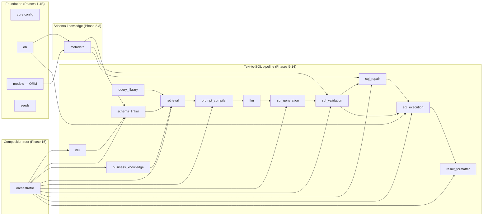
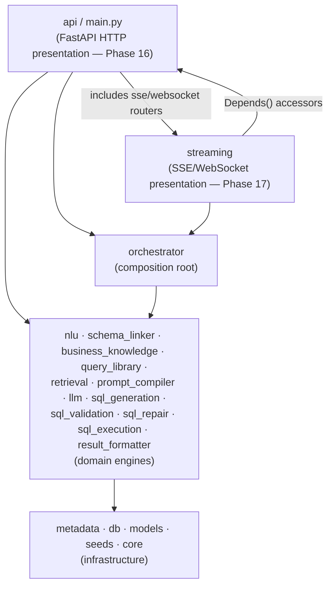
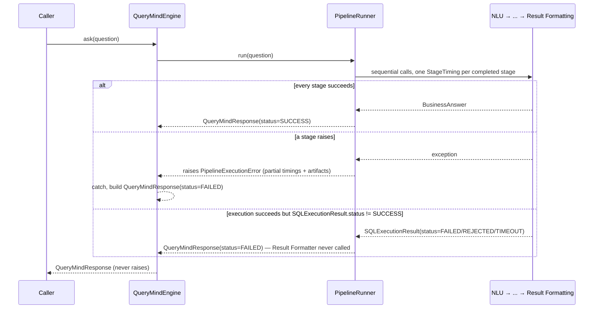

# QueryMind Architecture

This document is the canonical architecture reference for QueryMind. It
describes what is actually implemented, not what any earlier specification
proposed — where the two differ, this document follows the code.

## 1. Overall architecture

QueryMind is a **pipeline of small, single-responsibility engines**, each
implemented as its own top-level package under `src/querymind/`, composed
by one orchestrator (`querymind.orchestrator`) into a single end-to-end
call. There is no shared mutable state between stages: each stage receives
an immutable input, produces a new immutable output, and never mutates
what it was given.

`core`, `db`, `models`, and `metadata` are **infrastructure**, consumed
directly by multiple pipeline stages. `nlu` through `result_formatter` are
**domain engines**: each owns exactly one transformation, consumes only
the previous stage's output plus whatever infrastructure it genuinely
needs, and exposes exactly one public entry point (a `.parse()`, `.link()`,
`.retrieve()`, `.compile()`, `.generate()`, `.validate()`, `.repair()`,
`.execute()`, or `.format()` method on one class). `orchestrator` is the
**composition root**: the only package permitted to import and wire every
other pipeline package together.

## 2. Layered architecture

Four layers, strictly downward-dependent:

1. **Presentation** (`api`, `main.py`; `streaming` — Phase 17) — two
   sibling packages, both HTTP-adjacent, that never generate, validate,
   repair, execute, or format anything themselves. `api`: a thin FastAPI
   service layer (Phase 16) — every route validates its request,
   resolves an already-constructed engine via `Depends()`, calls that
   engine's own public entry point, and returns its result as a response
   model. `POST /query`, `/query/sql`, and `/query/repair` go through
   `orchestrator` (`QueryMindEngine`); `/query/validate`, `/query/execute`,
   and `/query/format` call a single domain engine directly, since they
   need no sequencing — see [§17](#17-http-presentation-layer-phase-16).
   `streaming` (Phase 17): exposes the same `QueryMindEngine.ask` call's
   *progress* over SSE/WebSockets — see
   [§18](#18-streaming-phase-17). The two packages depend on each other
   in opposite directions (`api.app` includes `streaming`'s routers;
   `streaming`'s routes resolve dependencies from `api.dependencies`) but
   this is a same-layer coupling between presentation-layer siblings, not
   a violation of the strict downward rule below — neither package is
   "lower" than the other, and neither `orchestrator` nor any domain
   engine ever imports from either.
2. **Composition root** (`orchestrator`) — the only *domain-layer* package
   that imports more than one or two adjacent domain engines. It sequences
   calls; it contains no business logic of its own.
3. **Domain engines** (`nlu` through `result_formatter`) — each is
   self-contained, importing only the infrastructure layer and, at most,
   the specific upstream models it needs to consume (e.g.
   `sql_repair` imports `sql_validation.models.SQLValidationResult`, never
   `sql_validation`'s internal validator classes).
4. **Infrastructure** (`metadata`, `db`, `models`, `seeds`, `core`) — no
   dependency on any domain engine. `metadata` is the one piece of
   infrastructure most domain engines depend on directly: it is the single
   source of truth for "what does the database look like," so that no
   domain engine ever imports `querymind.models` (SQLAlchemy) or opens a
   database connection to answer a schema question.

## 3. Dependency direction

Dependencies point in one direction only: **presentation → orchestrator →
domain engines → infrastructure.** No package in a lower layer imports
from a higher one. Within the domain-engine layer, dependencies follow
pipeline order — a later phase may import an earlier phase's public models
(e.g. `sql_validation` imports `sql_generation.models.GeneratedSQL`), but
never the reverse, and never another phase's private (underscore-prefixed
or non-exported) implementation classes. Every phase's `__init__.py`
defines its complete public surface via `__all__`; nothing outside that
list is considered part of the package's contract.

`querymind.orchestrator` is the single exception *within the domain-engine
layer* permitted to import across the whole layer at once — that breadth
is exactly its job as the composition root. `querymind.api.container`
(Phase 16) is the analogous exception one layer up: it is the only
presentation-layer module that imports every domain engine plus
`orchestrator`, because building the one process-wide
`ApplicationContainer` is its entire job — no route module imports more
than the handful of engines and dependency accessors its own endpoints
need. `querymind.streaming` (Phase 17) never imports a domain engine
directly, or even most of `orchestrator` — only `QueryMindEngine`,
`PipelineStage`/`QueryMindResponse` (models), and
`querymind.orchestrator.events.StageEventPublisher`, a `Protocol`
defined *inside* `orchestrator` specifically so it never has to import
`streaming` back — see [§18](#18-streaming-phase-17) for why that
Protocol exists at all.

## 4. Every package and its responsibility

| Package | Responsibility | Public entry point |
|---|---|---|
| `core` | Environment-driven `Settings`, structured logging setup | `Settings`, `configure_logging` |
| `db` | Async SQLAlchemy engine/session construction, declarative base | `create_engine`, `create_session_factory`, `Base` |
| `models` | SQLAlchemy ORM models for the 14-table domain schema | one module per table, all registered on `Base.metadata` |
| `seeds` | Synthetic, referentially valid dataset generation and persistence | `SeedOrchestrator`, `AsyncSessionTransactionRunner` |
| `metadata` | Single source of truth for schema structure + business dictionary | `MetadataRegistry` |
| `api` | FastAPI presentation layer — routes, DI container, exception mapping | `create_app`, `ApplicationContainer` |
| `nlu` | Deterministic parsing of a question into structured intent/entities | `QueryParser.parse` |
| `schema_linker` | Resolve business concept names onto real tables/columns | `SchemaLinker.link` |
| `business_knowledge` | Business terminology → business semantics (description, formula, examples) | `BusinessKnowledgeRegistry` |
| `query_library` | Curated gold-standard question→SQL example catalog | `QueryLibraryRegistry` |
| `retrieval` | Rank the most relevant few-shot examples for a linked question | `RetrievalEngine.retrieve` |
| `prompt_compiler` | Assemble a token-budgeted, validated LLM prompt | `PromptCompiler.compile` |
| `llm` | Provider-agnostic LLM call (retries, timeouts, parsing) | `LLMAdapter.generate` |
| `sql_generation` | Turn an LLM response into normalized `GeneratedSQL` | `SQLGenerationEngine.generate` |
| `sql_validation` | Ten independent read-only AST validators | `SQLValidationEngine.validate` |
| `sql_repair` | Bounded, automatic repair of invalid SQL via the LLM | `SQLRepairEngine.repair` |
| `sql_execution` | Read-only execution of validated SQL against the real database | `SQLExecutionEngine.execute` |
| `result_formatter` | Deterministic formatting of results into a `BusinessAnswer` | `ResultFormatterEngine.format` |
| `orchestrator` | Compose all of the above into one end-to-end call | `QueryMindEngine.ask` |
| `streaming` | SSE/WebSocket presentation layer — streams pipeline progress | `stream_pipeline_events`, `EventBus` |

See [`docs/project-structure.md`](docs/project-structure.md) for a
file-by-file breakdown within each package.

## 5. Why immutable models are used

Every model that crosses a phase boundary — from `QueryContext` through
`QueryMindResponse` — is a Pydantic v2 model with `model_config =
ConfigDict(frozen=True, extra="forbid")`, and every collection field is a
`tuple`, never a `list`. This is enforced, not a convention left to
discipline: a `frozen=True` Pydantic model raises on attribute
reassignment, and a `tuple` (unlike a `list` field on a frozen model)
genuinely cannot be mutated in place.

This matters specifically because the pipeline is a **strict, one-directional
chain of transformations**: `sql_repair` receives the `GeneratedSQL` and
`SQLValidationResult` that `sql_validation` produced and must never be able
to alter what `sql_validation` reported, even accidentally — repair
attempts always construct a *new* `GeneratedSQL`, never edit the original
in place. `extra="forbid"` catches a second, different class of bug: a
typo'd or stale field name in a constructor call fails immediately at
model construction, not silently three phases later when some consumer
reads a field that was never actually set.

## 6. Dependency Injection strategy

Every engine and collaborator in this codebase is **constructor-injected**,
with no global state, no singleton services, and no service locator
anywhere in the pipeline (see
[`docs/architecture-decisions.md`](docs/architecture-decisions.md) for the
rationale). Two recurring patterns:

- **Sensible-default collaborators.** A class's fine-grained internal
  collaborators (e.g. `SchemaLinker`'s `ConceptResolver`,
  `PromptCompiler`'s seven section builders) are typed as
  `Collaborator | None = None` and default to the standard implementation
  when omitted, so ordinary callers don't need to wire seven objects by
  hand — but a test or an alternate composition can substitute any of them
  without modifying the class.
- **Required-and-only-injected external dependencies.** A class's
  dependency on something the class itself cannot sensibly construct (a
  `MetadataRegistry`, a `DatabaseConnectionProvider`, an `LLMAdapter`) is a
  required constructor parameter with no default. `PipelineRunner`
  (`querymind.orchestrator.pipeline`) is the clearest example: all ten of
  its collaborators are required, fully-constructed instances of each
  phase's own public entry point — the orchestrator builds none of them
  itself, since only the actual composition root (a script, or eventually
  an API startup handler) has the real configuration (credentials, an
  event loop, a live database) needed to construct them.

## 7. Validation strategy

`sql_validation.SQLValidationEngine` parses `GeneratedSQL.sql` once with
`sqlglot` and runs ten independent validators against the resulting AST,
each read-only and single-purpose: syntax, schema (do referenced
tables/columns exist), table, column, join (is the join path real, per the
metadata `RelationshipGraph`), function, aggregate, alias, business rule
(`business_knowledge`-sourced constraints), and dialect. `validate()` never
raises for invalid SQL — every outcome, valid or not, is a structured
`SQLValidationResult` with `is_valid` plus a list of `ValidationIssue`s.
Validation never modifies the SQL it inspects; repairing invalid SQL is
`sql_repair`'s job, not this package's.

## 8. Repair strategy

`sql_repair.SQLRepairEngine.repair` runs only when `SQLValidationResult.is_valid`
is `False`. It reuses the existing Prompt Compiler, LLM Adapter, and SQL
Validation Engine over a bounded, deterministic loop (`DEFAULT_MAX_ATTEMPTS`
attempts): build a repair-specific prompt containing the original SQL and
its exact validation errors, call the LLM, extract and re-validate the
result, and stop as soon as a fully valid SQL is produced or the attempt
budget is exhausted. Every attempt's input and output is preserved in an
immutable `RepairHistory` — nothing is overwritten, and the original
`GeneratedSQL` is never mutated. Repair is a distinct phase from
validation specifically so validation stays a pure, side-effect-free
read: `RepairValidator` wraps the same `SQLValidationEngine` repair uses to
re-check its own output, rather than repair re-implementing any validation
logic itself.

## 9. Prompt compilation strategy

`prompt_compiler.PromptCompiler.compile` builds a `CompiledPrompt` from
seven independently constructed sections (system, business context, schema
context, relationships, retrieved examples, constraints, output format),
each produced by its own section builder from the `RetrievedKnowledgeBundle`.
A `PromptBudgetManager` trims the non-required sections (in a fixed,
documented order) until the whole prompt fits a configurable token budget,
and a `PromptValidator` checks the final result before it is returned.
Prompt compilation never calls an LLM and never generates SQL — it produces
text, nothing more; `llm.LLMAdapter` is a completely separate package with
no knowledge of prompts, sections, or SQL.

## 10. Retrieval strategy

`retrieval.RetrievalEngine.retrieve` ranks every `QueryExample` in the
`QueryLibraryRegistry` against the current `LinkedQueryContext` using eight
independent, deterministic signals (intent similarity, business concept
overlap, schema/table/column overlap, SQL feature overlap, keyword
overlap, difficulty similarity), combines them with configurable weights,
and returns the top-K as a `RetrievedKnowledgeBundle` — each retrieved
example carries a full `SignalBreakdown` explaining exactly why it scored
the way it did. No embeddings, no vector search, no LLM call anywhere in
this package.

## 11. SQL generation flow

`sql_generation.SQLGenerationEngine.generate` is the one place the LLM is
actually invoked: it sends the `CompiledPrompt` to the injected
`LLMAdapter`, extracts SQL text from the raw response (`SQLExtractor`),
normalizes it cosmetically (`SQLNormalizer`), detects the statement type,
and returns an immutable `GeneratedSQL` carrying the LLM's own
`GenerationMetrics` (including its independently measured latency) for
full traceability. It performs no validation, no execution, and no repair.

## 12. SQL validation flow

See [§7](#7-validation-strategy) above; see
[`docs/architecture-decisions.md`](docs/architecture-decisions.md) for why
`sqlglot` specifically was chosen over regex-based checks.

## 13. SQL repair flow

See [§8](#8-repair-strategy) above.

## 14. SQL execution flow

`sql_execution.SQLExecutionEngine.execute` is read-only in two independent,
overlapping ways:

1. **AST-level guard.** `ExecutionGuard` re-parses the exact SQL text about
   to run (with `sqlglot.parse`, not `parse_one`, specifically to catch
   multi-statement smuggling) and rejects anything that is not a single
   `SELECT`/`WITH ... SELECT` statement, walking the entire AST — not just
   the root node — to catch a write hidden inside a writable CTE.
2. **Database-level guard.** `DatabaseConnectionProvider` opens every
   connection with `postgresql_readonly=True`, so even a write that
   somehow evaded the AST guard would still be rejected by PostgreSQL
   itself.

It reuses the application's existing async `SQLAlchemy` engine (never
constructing a second one), executes under a caller-configurable timeout,
and converts every failure mode (rejection, timeout, database error,
formatting error) into a structured `SQLExecutionResult` — `execute()`
never raises for an ordinary execution failure.

## 15. Result formatting flow

`result_formatter.ResultFormatterEngine.format` accepts only a successful
`SQLExecutionResult` and produces an immutable `BusinessAnswer`: a
formatted table (deterministic, locale-independent value rendering via
`ValueFormatter`), a summary built strictly from the result's own shape
(row/column counts, column names — never inferred business meaning), and
an `AnswerType` classification (`SCALAR`/`TABLE`/`EMPTY_RESULT`/
`AGGREGATION`/`DETAIL`) derived from row/column counts plus a read-only
`sqlglot` inspection of the already-executed SQL text for aggregate
functions or `GROUP BY`. It performs no business calculation and produces
no visualization.

## 16. Orchestration flow

`PipelineRunner.run` performs the exact sequence (NLU → Schema Linking →
Business Knowledge → Retrieval → Prompt Compilation → SQL Generation
[which internally calls the LLM] → SQL Validation → SQL Repair
*conditionally, only when validation failed* → SQL Execution → Result
Formatting), timing every stage independently and reusing `SQLRepairResult
.final_sql`/`.final_validation_result` directly rather than re-validating
repaired SQL manually. `QueryMindEngine.ask` wraps `PipelineRunner.run` and
guarantees it never raises: any stage's own exception becomes a
`PipelineExecutionError` carrying every artifact and timing produced
before the failure, which `QueryMindEngine` converts into a `FAILED`
`QueryMindResponse` rather than losing that partial progress.

## 17. HTTP presentation layer (Phase 16)

`querymind.api` exposes the pipeline over REST without adding a second
implementation of anything the pipeline already does:

- **`container.ApplicationContainer`** (a frozen dataclass) is built
  exactly once, at process startup (`api.lifespan.lifespan`), by calling
  each phase's own constructor in dependency order — identical in spirit
  to the composition example in the [README](README.md#example-usage),
  just owned by the running process instead of a script. It performs no
  I/O itself: the database engine opens its first real connection lazily,
  on first use, so the container is safe to build even in a test process
  whose configured database is unreachable.
- **`dependencies`** exposes one `Annotated[T, Depends(get_T)]` accessor
  per engine the routers need, each reading straight off
  `request.app.state.container` — no route ever constructs an engine
  itself.
- **`routers/*.py`** — one module per HTTP resource (`query`, `sql`,
  `validation`, `repair`, `execution`, `formatting`, `health`,
  `diagnostics`, `metrics`), each a handful of lines: validate the
  request body (a request DTO in `api.models.request`, or a real pipeline
  model reused directly, per [§5](#5-why-immutable-models-are-used)'s
  "immutable models" rule), call one engine method, return its result as
  the response model. `sql.py` and `repair.py` needed two small,
  additive, behavior-preserving extensions to `PipelineRunner`/
  `QueryMindEngine` (`generate_sql`/`ask_for_sql`, stopping before
  execution; `repair_sql`/`repair`, rebuilding retrieval context from
  just a question and a validation result) — `run()`/`ask()` themselves
  are unchanged, verified by the full pre-existing orchestrator test
  suite passing unmodified.
- **`exception_handlers`** maps every domain exception the pipeline can
  raise onto a deterministic HTTP status via one lookup table, and
  specially unwraps `PipelineExecutionError.__cause__` so a caller of
  `/query/sql` sees the *real* failing exception (e.g.
  `DatabaseConnectionError` → `503`), never the orchestrator's own wrapper
  type. No handler ever returns a traceback.
- **`middleware.RequestContextMiddleware`** binds a request/correlation ID
  pair (accepted from inbound headers, or generated) to every log line
  for the request's duration, and wraps the whole request in
  `querymind.observability`'s own `StageInstrumentation` — the same
  context manager that instruments a pipeline stage, just wrapping one
  HTTP request instead — so no second, parallel logging implementation
  exists for the API layer.

Every route is intentionally too thin to unit-test its own "logic",
because it has none: `tests/api`'s unit tests instead assert that a route
resolves the *right* dependency and calls it with the *right* arguments
(mocking that one engine), while `tests/api/test_integration.py` runs the
same real-pipeline-plus-`httpx.MockTransport` precedent as every other
phase's own `test_integration.py` against the actual FastAPI app.

## 18. Streaming (Phase 17)

`querymind.streaming` exposes one `QueryMindEngine.ask` call's *progress*
in real time, over both Server-Sent Events and WebSockets, without a
second implementation of the pipeline and without either transport
knowing anything about the other:

- **The problem this package solves.** `PipelineRunner.run` is one
  coroutine call — awaiting it returns a `QueryMindResponse` only once
  every stage has finished; there is no built-in way to observe it
  mid-flight. Rather than duplicate `run`'s sequencing in the
  presentation layer (explicitly forbidden — rule 2 of the Phase 17
  spec: "do not duplicate orchestration"), `run` itself was given one
  small, purely additive seam: an optional `event_publisher` parameter,
  `None` by default, awaited at every stage boundary it already tracks
  for `StageTiming`. Passing nothing (every caller before Phase 17, and
  every non-streaming caller since) is a true no-op — verified by the
  full pre-existing orchestrator test suite passing completely
  unmodified, plus new tests asserting the returned `QueryMindResponse`
  is unaffected either way. This is the same kind of small, additive,
  behavior-preserving extension Phase 16 made to add `generate_sql`/
  `repair_sql` — see [§16](#16-orchestration-flow).
- **`orchestrator.events.StageEventPublisher`** is what `event_publisher`
  is typed as: a minimal `Protocol` (`pipeline_started`, `stage_started`,
  `stage_completed`, `stage_failed`, `pipeline_completed`,
  `pipeline_failed`) defined *inside* `orchestrator`, not `streaming` —
  preserving the strict downward dependency direction from
  [§3](#3-dependency-direction): `orchestrator` must never import from
  the presentation layer, so the interface it depends on has to live on
  its own side of that boundary. `streaming.events.PipelineEventEmitter`
  implements it structurally (no inheritance, no import the other way)
  and is the only class in this package that knows both "what a
  `PipelineRunner` callback looks like" and "what a `PipelineEvent`
  looks like."
- **Event model hierarchy (`streaming.models`).** One base
  `PipelineEvent` (`event_id`, `correlation_id`, `timestamp`,
  `pipeline_stage`, `event_type`, `payload`) and nine frozen subclasses —
  `PipelineStartedEvent`, `StageStartedEvent`, `StageCompletedEvent`,
  `StageFailedEvent`, `PipelineCompletedEvent`, `PipelineFailedEvent`,
  `HeartbeatEvent`, `ClientDisconnectedEvent` — each fixing `event_type`
  to one value via a `Literal` default and providing a typed `.create(...)`
  classmethod. No subclass adds a new top-level field: type-specific data
  always lives in `payload`, so every event, regardless of which
  subclass produced it, serializes to the same six-key JSON shape (see
  [§5](#5-why-immutable-models-are-used)'s "immutable models" rule,
  applied here too) — a client never needs a discriminated-union decoder,
  just `event_type` to know how to interpret `payload`.
- **`event_bus.EventBus`** is the in-process, async, fan-out pub/sub
  broker: `subscribe(correlation_id)` hands back an independent,
  unbounded `asyncio.Queue`-backed `Subscription`; `publish(event)` fans
  `event` out to every subscriber currently registered for
  `event.correlation_id`, a no-op if nobody is listening. No external
  broker (Kafka/Redis/RabbitMQ — explicitly forbidden, rule 9) and no
  persistent subscriptions: a topic exists only as long as at least one
  subscriber does. Publishers (`publisher.EventPublisher`) and
  subscribers (`subscriber.EventSubscriber`) each only ever talk to the
  bus, never to each other directly (rule 3).
- **`subscriber.stream_pipeline_events`** is the one transport-agnostic
  driver both endpoints below reuse: it subscribes to the bus, starts
  `QueryMindEngine.ask(question, event_publisher=...)` as a background
  `asyncio.Task`, starts a periodic heartbeat task alongside it
  (`asyncio.wait_for(asyncio.shield(pipeline_task), timeout=interval)` —
  `shield` is required so the heartbeat's own timeout never cancels the
  pipeline task it's timing), and yields events until a terminal one
  arrives. If the consumer stops early (a client disconnect closes this
  async generator), its `finally` block cancels both tasks and
  unsubscribes — nothing is ever left running (rule 8). Because
  `QueryMindEngine.ask` is contractually guaranteed to never raise and
  to always publish a terminal event itself first, the driver's own
  defensive fallback (racing the next queued event against the pipeline
  task's own completion, synthesizing a `PipelineFailedEvent` if the task
  finished without ever publishing one) only matters if that contract is
  ever violated — but "always emit a final event before closing" (the
  spec's Error Handling rule) has to hold regardless of why.
- **`sse.py` (`POST /query/stream`) and `websocket.py` (`/ws/query`)**
  are both a few dozen lines: parse the request, resolve
  `QueryMindEngineDep`/`EventBusDep`/`LoggerDep` (`api.dependencies`,
  extended to accept a `starlette.requests.HTTPConnection` rather than a
  concrete `Request`, since FastAPI never auto-injects a `Request` for a
  WebSocket route or a `WebSocket` for an HTTP one), iterate
  `stream_pipeline_events`, and format each event for their own transport
  (`sse.py`: `event:`/`id:`/`data:` frames via `serializer.serialize_event`;
  `websocket.py`: one JSON text frame per event). Neither module
  generates, validates, repairs, executes, or formats anything (rule 1).
  `websocket.py` binds its own request/correlation ID and `structlog`
  context, since `api.middleware.RequestContextMiddleware`
  (`BaseHTTPMiddleware`) only ever wraps `http`-scope requests, never
  `websocket`-scope connections — `sse.py` instead reuses the ID that
  middleware already bound to its (ordinary HTTP `POST`) request.
- **Observability.** Both endpoints log connection-opened,
  connection-closed, event-sent, and client-disconnected through the
  same `ApplicationContainer.logger` (`StructuredLogger`) every other
  phase uses — no second, parallel logging path (rule 7).
- **`cache.EventReplayCache`** is defined, `NoOpEventReplayCache` is its
  only implementation, and nothing calls it — mirroring
  `orchestrator.cache`/`sql_execution.cache`/`result_formatter.cache`'s
  own "protocol defined, deliberately not wired up" precedent. A real
  implementation (an in-memory ring buffer of recent events per
  `correlation_id`, letting a briefly-dropped client ask to replay what
  it missed) is a genuine, real feature — and explicitly out of this
  phase's scope.

Every piece above is intentionally too thin to unit-test its own
"logic," for the same reason `api`'s routes are: `tests/streaming`'s
unit tests assert that `EventBus`/`EventPublisher`/`EventSubscriber`/
`stream_pipeline_events` each do exactly their one job (including the
heartbeat and cancellation paths, driven by a scripted fake
`QueryMindEngine`), while `tests/streaming/test_integration.py` reuses
the real-pipeline-plus-`httpx.MockTransport` precedent against the
actual FastAPI app, over both transports.

See [`SYSTEM_DESIGN.md`](SYSTEM_DESIGN.md) for the complete model-by-model
walkthrough of what flows between every stage.
