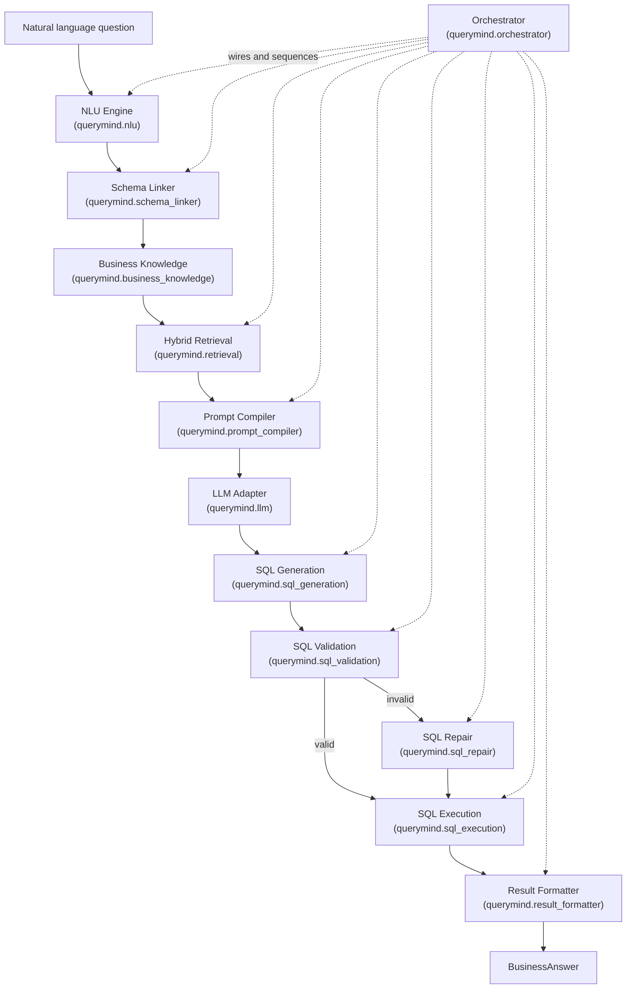

# QueryMind — Text-to-SQL Analytics Engine

[](https://github.com/SumaTallapragada/querymind/actions/workflows/backend.yml)
[](https://github.com/SumaTallapragada/querymind/actions/workflows/frontend.yml)
[](https://github.com/SumaTallapragada/querymind/actions/workflows/docker.yml)
[](https://github.com/SumaTallapragada/querymind/actions/workflows/integration.yml)

**Version:** 1.0.0 (QueryMind Core Engine) — see
[`CHANGELOG.md`](CHANGELOG.md) and [`VERSION_HISTORY.md`](VERSION_HISTORY.md).

**CI/CD:** every push/PR runs Fast CI (lint, type-check, unit tests, both Docker images) in a
couple of minutes; the full suite against a real, `docker compose`-provisioned PostgreSQL runs
nightly, on demand, and on release tags. See [`docs/ci-cd.md`](docs/ci-cd.md) for the full
two-tier strategy, required secrets, and how to trigger any workflow manually.

QueryMind turns a natural language business question into a real, executed
SQL query and a formatted answer — without an ORM query, a hardcoded
report, or a human writing SQL by hand. It is built as a sequence of small,
independently testable engines, each owning exactly one responsibility,
composed by a single orchestrator into one end-to-end pipeline.

**Status:** the core engine (natural language question → `BusinessAnswer`)
is feature-complete through Phase 15 and fully covered by tests running
against a real PostgreSQL database. As of Phase 16 it is also exposed over
a thin FastAPI HTTP service layer — see [HTTP API](#http-api) below — with
every route delegating straight to the same engines the library entry
point uses. As of Phase 17, that same pipeline's progress can also be
streamed in real time over Server-Sent Events or WebSockets — see
[Streaming](#streaming-sse--websockets). See [Project roadmap](#project-roadmap)
and [`docs/KNOWN_LIMITATIONS.md`](docs/KNOWN_LIMITATIONS.md) for the complete
list of what this release does not include.

## Goals

- Convert an analyst's natural language question into correct, validated,
  read-only SQL against a real relational schema.
- Never guess silently: every stage that can fail — ambiguous schema
  linking, invalid SQL, a failed execution — produces a structured,
  inspectable result instead of a best-effort guess.
- Keep every phase substitutable and independently testable through
  constructor dependency injection, with no global state and no singleton
  services anywhere in the pipeline.
- Reuse deterministic techniques (rule-based parsing, `sqlglot` ASTs, schema
  metadata, a curated example library) wherever they are sufficient, and
  reserve the LLM call for exactly the one step that needs it — turning a
  compiled prompt into SQL text.

## Key features

- **Deterministic NLU** — intent, entities, metrics, filters, time ranges,
  sorting, and limits extracted from a question with no embeddings, no
  vector search, and no LLM call.
- **Schema linking against a live metadata registry** — business concept
  names resolved to real tables/columns via exact match, business
  dictionary lookup, synonyms, alias expansion, and fuzzy matching, with
  every unresolved concept recorded as an explicit ambiguity rather than a
  silent guess.
- **Explainable hybrid retrieval** — the most relevant few-shot examples
  from a curated query library, ranked by eight independent, weighted
  signals with a full score breakdown per candidate.
- **Token-budgeted prompt compilation** — seven independently built prompt
  sections, validated and trimmed to fit a configurable token budget.
- **Provider-agnostic LLM adapter** — retries, timeouts, and response
  parsing isolated behind one interface; the only component in the whole
  pipeline that makes a network call.
- **AST-based SQL validation** — ten independent, read-only validators
  (syntax, schema, table, column, join, function, aggregate, alias,
  business rule, dialect) built on `sqlglot`, never regex.
- **Bounded, automatic SQL repair** — invalid SQL is fed back to the LLM
  with the exact validation errors, over a capped retry loop, with the
  full attempt history preserved.
- **Defense-in-depth read-only execution** — an independent AST guard plus
  a database-level read-only transaction, so a write can never reach the
  database even if a validation gap exists upstream.
- **Deterministic result formatting** — query rows converted into an
  immutable, locale-independent `BusinessAnswer` with no charts, no
  markdown, and no invented business interpretation.
- **One orchestrator, fully wired** — `QueryMindEngine.ask()` runs the
  complete pipeline end to end, times every stage independently, and never
  raises — every failure becomes a structured, typed response.

## Architecture



Metadata about the real database schema (`querymind.metadata`) is consumed
directly by schema linking, validation, and repair — never inferred, never
duplicated. See [`ARCHITECTURE.md`](ARCHITECTURE.md) for the full layered
picture, dependency direction, and every package's responsibility.

## End-to-end pipeline

| # | Stage | Package | Input → Output |
|---|---|---|---|
| 1 | NLU | `querymind.nlu` | question `str` → `QueryContext` |
| 2 | Schema Linking | `querymind.schema_linker` | `QueryContext` → `LinkedQueryContext` |
| 3 | Business Knowledge | `querymind.business_knowledge` | (loaded, consumed by retrieval/validation) |
| 4 | Retrieval | `querymind.retrieval` | `LinkedQueryContext` → `RetrievedKnowledgeBundle` |
| 5 | Prompt Compilation | `querymind.prompt_compiler` | `RetrievedKnowledgeBundle` → `CompiledPrompt` |
| 6 | LLM | `querymind.llm` | `CompiledPrompt` → `LLMResponse` (called inside step 7) |
| 7 | SQL Generation | `querymind.sql_generation` | `CompiledPrompt` → `GeneratedSQL` |
| 8 | SQL Validation | `querymind.sql_validation` | `GeneratedSQL` → `SQLValidationResult` |
| 9 | SQL Repair (conditional) | `querymind.sql_repair` | invalid `GeneratedSQL` → `SQLRepairResult` |
| 10 | SQL Execution | `querymind.sql_execution` | valid SQL → `SQLExecutionResult` |
| 11 | Result Formatting | `querymind.result_formatter` | successful `SQLExecutionResult` → `BusinessAnswer` |

`querymind.orchestrator.QueryMindEngine.ask(question)` runs all eleven
stages and returns one immutable `QueryMindResponse` — see
[`SYSTEM_DESIGN.md`](SYSTEM_DESIGN.md) for what flows between every stage
and why each phase exists.

## HTTP API

Phase 16 adds a FastAPI service layer over the pipeline described above.
Every route is deliberately thin — it validates the request, resolves a
dependency-injected engine, calls that engine's own public entry point, and
returns its result as-is; no route generates, validates, repairs, or
executes SQL itself, and no business logic exists in `querymind.api`. All
routes are mounted under `settings.api_v1_prefix` (`/api/v1` by default).

| Method | Path | Calls | Returns |
|---|---|---|---|
| `POST` | `/query` | `QueryMindEngine.ask` | `QueryMindResponse` — the complete pipeline, end to end |
| `POST` | `/query/sql` | `QueryMindEngine.ask_for_sql` | `GeneratedSqlResult` — generation through conditional repair, never executes |
| `POST` | `/query/validate` | `SQLValidationEngine.validate` | `SQLValidationResult` — validates externally supplied SQL |
| `POST` | `/query/repair` | `QueryMindEngine.repair` | `SQLRepairResult` — repairs SQL that failed validation |
| `POST` | `/query/execute` | `SQLExecutionEngine.execute` | `SQLExecutionResult` — executes already-validated SQL, read-only |
| `POST` | `/query/format` | `ResultFormatterEngine.format` | `BusinessAnswer` — formats a successful execution result |
| `GET` | `/health` | `HealthCheckEngine.check` | `HealthReport` — `503` if `overall_status` is `unhealthy` |
| `GET` | `/health/live` | *(none — process liveness only)* | `{"status": "ok"}` |
| `GET` | `/health/diagnostics` | `DiagnosticsEngine.run` | `DiagnosticsReport` — `503` only if `overall_status` is `error` |
| `GET` | `/health/metrics` | `MetricsCollector.snapshot` | `MetricsSnapshot` — point-in-time, never resets counters |

Every request carries an `X-Request-ID`/`X-Correlation-ID` pair (accepted
from inbound headers when present, otherwise generated) that is echoed
back on the response and bound to every structured log line emitted while
handling it, via `querymind.observability`'s own `StageInstrumentation` —
reused here exactly as it instruments a pipeline stage, just wrapping one
HTTP request instead.

Example — the primary endpoint, end to end:

```bash
curl -X POST http://localhost:8000/api/v1/query \
  -H "Content-Type: application/json" \
  -d '{"question": "Who are our top 5 customers by revenue?"}'
```

```json
{
  "original_question": "Who are our top 5 customers by revenue?",
  "status": "success",
  "generated_sql": {"sql": "SELECT ... LIMIT 5;"},
  "business_answer": {"answer_type": "ranked_list", "formatted_table": {"...": "..."}},
  "error": null
}
```

`status` (`success`/`failed`), not the HTTP status code, is how a caller
distinguishes a pipeline-level failure from success — `POST /query` always
returns `200` for a completed run, exactly as `QueryMindEngine.ask` never
raises. Genuinely unexpected failures (a misconfigured collaborator, an
unreachable database) are instead mapped by
`querymind.api.exception_handlers` onto the appropriate `4xx`/`5xx` status,
with a body of the form `{"detail": "...", "error_type": "..."}` and no
traceback ever leaked to the client. Interactive OpenAPI docs (request/
response examples, full schemas) are served at `/docs` once the app is
running.

## Authentication

Phase 22A adds user accounts and JWT-based sessions, in two additive parts: Part 1 built
`querymind.auth` as a self-contained library (user accounts, Argon2 password hashing, JWT
access/refresh tokens) with no FastAPI dependency at all; Part 2 wired it into the same HTTP API
described above, following the exact same "thin route, one engine call" pattern every other
endpoint already uses. **No existing endpoint requires authentication yet** — `/auth/*` is
purely additive, and there is no authorization/RBAC layer yet (see
[Project roadmap](#project-roadmap)).

| Method | Path | Calls | Returns |
|---|---|---|---|
| `POST` | `/auth/register` | `AuthenticationService.register_user` | `UserRead` (`201`) — `409` if the username/email is taken |
| `POST` | `/auth/login` | `AuthenticationService.authenticate` + `.create_token_pair` | `TokenPair` (`200`) — `401`/`403` for bad credentials/an inactive account |
| `POST` | `/auth/refresh` | `AuthenticationService.refresh_tokens` | `TokenPair` (`200`) — rotates the given refresh token, which is then revoked |
| `POST` | `/auth/logout` | `AuthenticationService.logout` | `204`, no body — revokes the given refresh token only |
| `GET` | `/auth/me` | `AuthenticationService.get_current_user` | `UserRead` (`200`) — requires `Authorization: Bearer <access_token>` |

**JWT lifecycle:** `POST /auth/login` issues one access token (short-lived, default 30 minutes)
and one refresh token (long-lived, default 14 days); every route that requires a caller's
identity reads the access token from the `Authorization: Bearer <token>` header. When the
access token expires, `POST /auth/refresh` exchanges the still-valid refresh token for a brand
new pair — the old refresh token is revoked as part of that call (rotation), so it can never be
reused, whether or not the new pair ever is. `POST /auth/logout` revokes a refresh token
directly, ending that session; it does not, and cannot, invalidate an access token already
issued from it, which simply expires on its own.

Example — register, log in, and call the one protected route:

```bash
curl -X POST http://localhost:8000/api/v1/auth/register \
  -H "Content-Type: application/json" \
  -d '{"username": "alice", "email": "alice@example.com", "password": "a-strong-password"}'

curl -X POST http://localhost:8000/api/v1/auth/login \
  -H "Content-Type: application/json" \
  -d '{"username": "alice", "password": "a-strong-password"}'
# {"access_token": "eyJ...", "refresh_token": "eyJ...", "token_type": "bearer"}

curl http://localhost:8000/api/v1/auth/me \
  -H "Authorization: Bearer eyJ..."
# {"id": 1, "username": "alice", "email": "alice@example.com", "is_active": true, "is_superuser": false, ...}
```

Configure `JWT_SECRET_KEY` (required for production — the default is a clearly-labeled,
insecure placeholder), `JWT_ALGORITHM` (default `HS256`), `ACCESS_TOKEN_EXPIRE_MINUTES`
(default `30`), and `REFRESH_TOKEN_EXPIRE_DAYS` (default `14`) via `.env` — see
`.env.example`. See [`ARCHITECTURE.md` §19](ARCHITECTURE.md#19-authentication-phase-22a) for
how the library and the API layer are wired.

## Streaming (SSE & WebSockets)

Phase 17 adds real-time progress over the same pipeline `POST /query`
runs — no SQL generated, validated, repaired, executed, or formatted
differently; streaming only reports what `QueryMindEngine.ask` is
already doing, as it happens. Both endpoints emit the same sequence of
events and end with a `pipeline_completed`/`pipeline_failed` event
carrying the `BusinessAnswer`:

| Event | When |
|---|---|
| `pipeline_started` | The run began. |
| `stage_started` / `stage_completed` | Each of NLU, schema linking, business knowledge, retrieval, prompt compilation, SQL generation, the LLM call, validation, (conditional) repair, execution, and result formatting. |
| `stage_failed` | A stage's own call raised. |
| `heartbeat` | Sent periodically once a run has taken more than a few seconds, so the connection never looks stalled. |
| `pipeline_completed` | The run finished — `payload.status` (`success`/`failed`) and, on success, `payload.business_answer`. |
| `pipeline_failed` | The run raised — `payload.error_type`/`error_message`. |

**Server-Sent Events** — `POST /api/v1/query/stream`, `text/event-stream`:

```bash
curl -N -X POST http://localhost:8000/api/v1/query/stream \
  -H "Content-Type: application/json" \
  -d '{"question": "Who are our top 5 customers by revenue?"}'
```

```
event: pipeline_started
data: {"event_id":"...","correlation_id":"...","event_type":"pipeline_started","payload":{"original_question":"Who are our top 5 customers by revenue?"}}

event: stage_started
data: {"event_id":"...","pipeline_stage":"nlu","event_type":"stage_started","payload":{}}

...

event: pipeline_completed
data: {"event_id":"...","event_type":"pipeline_completed","payload":{"status":"success","business_answer":{"...":"..."}}}
```

**WebSocket** — `/ws/query` (unversioned): send one `{"question": "..."}` message, receive the
same events as JSON text frames, connection closes after the terminal one.

```javascript
const ws = new WebSocket("ws://localhost:8000/ws/query");
ws.onopen = () => ws.send(JSON.stringify({ question: "Who are our top 5 customers by revenue?" }));
ws.onmessage = (msg) => {
  const event = JSON.parse(msg.data);
  console.log(event.event_type, event.payload);
};
```

Every event shares one correlation ID with the HTTP request that opened
the stream (SSE) or the connection itself (WebSocket) — the same ID
`RequestContextMiddleware` already binds to every structured log line
for that request. If a client disconnects mid-stream, the pipeline call
still in flight is cancelled and cleaned up server-side; nothing is left
running. See [`ARCHITECTURE.md`](ARCHITECTURE.md#18-streaming-phase-17)
for how events get from `PipelineRunner` to the wire.

## Technology stack

| Concern | Choice |
|---|---|
| Language | Python 3.12 |
| Web framework | FastAPI — a thin presentation layer over the pipeline; see [HTTP API](#http-api) |
| Database | PostgreSQL 16, async via SQLAlchemy 2.0 + asyncpg |
| Migrations | Alembic (async) |
| Data models | Pydantic v2 — every cross-phase model is `frozen=True`, `extra="forbid"` |
| SQL parsing | `sqlglot` — every AST-level check (validation, repair, execution guard) |
| LLM provider | Anthropic Claude, via a raw `httpx` client (no vendor SDK dependency) |
| Config | `pydantic-settings`, environment-driven, no hardcoded values |
| Logging | `structlog`, JSON in production / console in development |
| Dependency management | [`uv`](https://docs.astral.sh/uv/) |
| Linting / formatting | Ruff |
| Static typing | MyPy, `strict = true` |
| Testing | pytest, `pytest-asyncio`, `pytest-cov`, `httpx.MockTransport` for the LLM |
| Synthetic data | Faker-driven seed generators for a full e-commerce dataset |

## Installation

```bash
git clone <repository-url>
cd Text-to-SQLAnalyticsEngine
cp .env.example .env
# edit .env — at minimum, set a real POSTGRES_PASSWORD
uv sync
```

`uv sync` installs both runtime and development dependencies into `.venv`.
Every configurable value is documented in `.env.example` and loaded through
`querymind.core.config.Settings` — nothing in the application reads
`os.environ` directly anywhere else.

## Database setup

**Option A — Docker Compose (recommended):**

```bash
docker compose up --build
```

Starts PostgreSQL 16 and the FastAPI app together; the app waits for
Postgres to report healthy before starting.

**Option B — local Postgres, run the app on the host:**

```bash
# ensure Postgres is reachable at POSTGRES_HOST/POSTGRES_PORT in .env
uv run alembic upgrade head
uv run uvicorn querymind.main:app --reload
```

Apply the schema (14 tables — customers, orders, payments, products,
suppliers, inventory, warehouses, shipments, promotions, reviews, returns,
and their supporting tables):

```bash
uv run alembic upgrade head
```

## Seed generation

The `querymind.seeds` package generates a coherent, referentially valid
synthetic e-commerce dataset (customers, orders, payments, shipments,
inventory, promotions, reviews, returns, ...) and persists it through one
shared database session, in dependency order, via
`scripts/seed_database.py`:

```bash
uv run python scripts/seed_database.py                          # full-scale default dataset
uv run python scripts/seed_database.py --dataset-size small     # quick smoke test
uv run python scripts/seed_database.py --dataset-size medium
uv run python scripts/seed_database.py --scenario black_friday  # a named demand scenario
uv run python scripts/seed_database.py --seed 7                 # reproducible run
```

Equivalent `make` targets: `make seed`, `make seed-small`,
`make seed-medium`. After generation, the script runs a post-generation
`DatasetValidator` pass against PostgreSQL and prints a summary.

## Running tests

```bash
uv run pytest
```

The suite requires a reachable PostgreSQL instance (see
[Database setup](#database-setup)) — most phases from `sql_execution`
onward run real queries against it; every LLM-touching test replaces the
network with `httpx.MockTransport`, so no test ever makes a real API call.
`tests/conftest.py` also builds the FastAPI app with an explicit, hermetic
`Settings` instance for the API-layer tests, independent of `.env`.

```bash
uv run pytest tests/orchestrator -q   # one phase's suite in isolation
uv run pytest tests/api -q            # the HTTP API layer (unit + integration)
uv run pytest tests/streaming -q      # SSE/WebSocket streaming (unit + integration)
uv run pytest -q                      # the whole repository
```

See [`docs/testing.md`](docs/testing.md) for the full test philosophy.

## Running quality checks

```bash
uv run ruff check .           # lint
uv run ruff format --check .  # formatting
uv run mypy src                # static typing (strict)
uv run pytest                   # tests + coverage
```

Or the combined local gate:

```bash
make check   # lint + typecheck + test
```

## Example usage

Most callers should use the [HTTP API](#http-api) — `POST /query` runs
exactly the sequence below. The engine remains fully usable as a plain
Python library too (this is what `querymind.api.container.ApplicationContainer`
itself does at startup): wire one already-constructed instance of every
phase's own public entry point into a `PipelineRunner`, then a
`QueryMindEngine`:

```python
import asyncio

from querymind.business_knowledge import BusinessKnowledgeRegistry
from querymind.core.config import Settings
from querymind.db.engine import create_engine
from querymind.llm.adapter import LLMAdapter
from querymind.llm.config import LLMProviderConfig
from querymind.llm.models import LLMProvider
from querymind.llm.providers.claude import ClaudeProvider
from querymind.metadata import ColumnDictionary, MetadataExtractor, MetadataRegistry
from querymind.models.base import Base
import querymind.models  # noqa: F401 -- registers every ORM model on Base.metadata
from querymind.nlu import QueryParser
from querymind.orchestrator import PipelineRunner, QueryMindEngine
from querymind.prompt_compiler import PromptCompiler
from querymind.query_library import QueryLibraryRegistry
from querymind.result_formatter import ResultFormatterEngine
from querymind.retrieval import RetrievalEngine
from querymind.schema_linker import SchemaLinker
from querymind.sql_execution import DatabaseConnectionProvider, SQLExecutionEngine
from querymind.sql_generation import SQLGenerationEngine
from querymind.sql_repair import SQLRepairEngine, SQLRepairLLMAdapter
from querymind.sql_repair.validator import RepairValidator
from querymind.sql_validation import SQLValidationEngine


async def main() -> None:
    settings = Settings()
    engine = create_engine(settings)

    metadata_registry = MetadataRegistry(MetadataExtractor(Base.registry), ColumnDictionary.default())
    metadata_registry.load()
    business_knowledge = BusinessKnowledgeRegistry()
    business_knowledge.load()
    query_library = QueryLibraryRegistry()
    query_library.load()

    llm_config = LLMProviderConfig(provider=LLMProvider.CLAUDE, model="claude-sonnet-5", api_key=...)
    llm_adapter = LLMAdapter(ClaudeProvider(llm_config), llm_config)
    validation_engine = SQLValidationEngine(metadata_registry, business_knowledge)

    runner = PipelineRunner(
        nlu_parser=QueryParser(),
        schema_linker=SchemaLinker(metadata_registry),
        business_knowledge_registry=business_knowledge,
        retrieval_engine=RetrievalEngine(query_library=query_library, business_knowledge=business_knowledge),
        prompt_compiler=PromptCompiler(),
        sql_generation_engine=SQLGenerationEngine(llm_adapter),
        sql_validation_engine=validation_engine,
        sql_repair_engine=SQLRepairEngine(SQLRepairLLMAdapter(llm_adapter), RepairValidator(validation_engine)),
        sql_execution_engine=SQLExecutionEngine(DatabaseConnectionProvider(engine)),
        result_formatter_engine=ResultFormatterEngine(),
    )

    response = await QueryMindEngine(runner).ask("Who are our top 5 customers by revenue?")
    print(response.status, response.business_answer)
    await engine.dispose()


asyncio.run(main())
```

`QueryMindEngine.ask()` never raises — `response.status` is always either
`SUCCESS` (`response.business_answer` populated) or `FAILED`
(`response.error` populated). See [`docs/pipeline.md`](docs/pipeline.md)
for a worked example with real output.

## Folder structure

```
src/querymind/
├── main.py                # Thin re-export of querymind.api.app.create_app
├── core/                    # Settings, logging — read by every layer
├── api/                     # Phase 16 — FastAPI presentation layer (app.py, container.py,
│                            #   dependencies.py, lifespan.py, middleware.py,
│                            #   exception_handlers.py, routers/, models/)
├── db/                      # Async engine/session infrastructure
├── models/                  # SQLAlchemy ORM models (14 domain tables)
├── seeds/                   # Synthetic dataset generation + persistence
├── metadata/                 # Schema metadata registry (Phase 2-3)
├── nlu/                      # Phase 5   — Natural Language Understanding
├── schema_linker/              # Phase 6   — Semantic Schema Linker
├── business_knowledge/          # Phase 7   — Business Knowledge Engine
├── query_library/              # Phase 8   — Query Intelligence Library
├── retrieval/                  # Phase 9   — Knowledge Retrieval Engine
├── prompt_compiler/             # Phase 10A — Prompt Compiler
├── llm/                        # Phase 10B — LLM Adapter
├── sql_generation/              # Phase 11A — SQL Generation Engine
├── sql_validation/              # Phase 11B — SQL Validation Engine
├── sql_repair/                 # Phase 12  — SQL Repair Engine
├── sql_execution/               # Phase 13  — SQL Execution Engine
├── result_formatter/            # Phase 14  — Result Formatter / Answer Generator
├── orchestrator/                # Phase 15  — End-to-End QueryMind Orchestrator
└── streaming/                   # Phase 17  — SSE/WebSocket progress streaming (models.py,
                               #   event_bus.py, publisher.py, subscriber.py, events.py,
                               #   serializer.py, sse.py, websocket.py, cache.py)

tests/                        # One directory per package above, same names
scripts/seed_database.py       # CLI entry point for seed generation
alembic/                      # Async database migrations
docs/                         # Extended documentation (this file links out to it)
```

See [`docs/project-structure.md`](docs/project-structure.md) for every
package's responsibility in detail.

## Project roadmap

Implemented (Phases 1–15.5, released as v1.0.0): application foundation,
database schema and seeding, metadata engine, the complete eleven-stage
text-to-SQL pipeline described above ending at an immutable
`BusinessAnswer`, and a stabilization/release-readiness pass — see
[`VERSION_HISTORY.md`](VERSION_HISTORY.md) for the full narrative. Phase
16 adds the FastAPI service layer described in [HTTP API](#http-api);
Phase 17 adds the real-time streaming described in
[Streaming](#streaming-sse--websockets); Phase 22A adds user accounts and
JWT authentication, described in [Authentication](#authentication).

Not yet implemented — explicitly deferred, phase by phase, throughout this
project's history (see [`docs/KNOWN_LIMITATIONS.md`](docs/KNOWN_LIMITATIONS.md)
for the complete, current list):

- CLI for interactive question-asking.
- Authorization/RBAC, API keys, OAuth/SSO — Phase 22A adds authentication
  (who a caller is) only; no existing endpoint requires it yet, and
  nothing yet governs what an authenticated caller may do.
- A frontend (React or otherwise).
- Result visualization — charts, HTML tables, CSV/Excel export.
- Result caching — every phase defines a cache `Protocol` and a
  `NoOp*` implementation, deliberately not wired up.
- Production deployment tooling beyond the existing `Dockerfile`/
  `docker-compose.yml` pair (Kubernetes manifests, CI/CD, etc.).

## License

Proprietary. No license has been formally selected yet — see
`pyproject.toml`'s `license` field. Replace this section before any public
release.
