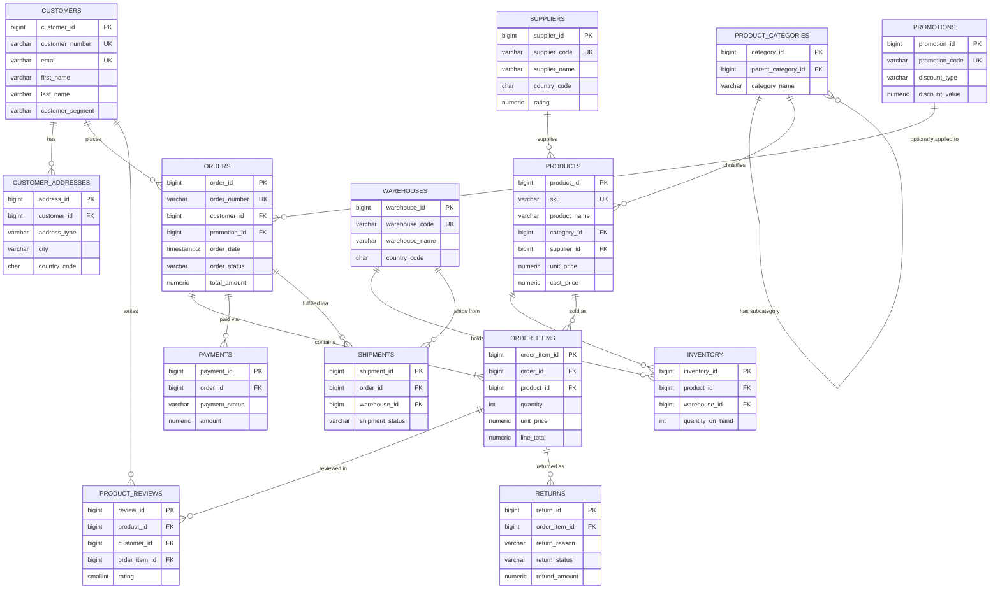

# QueryMind AI — Phase 2: E-Commerce Analytics Database Design

**Status:** Design documentation only. No SQLAlchemy models, no Alembic migrations, no
application code exist yet — those are Phase 3+. This document is the single source of
truth that Phase 3 (ORM models + migrations) and the later Schema Linker / Text-to-SQL
pipeline are built from.

**How to use this document:** Section 5 (Data Dictionary) and Section 7 (Intentional
Ambiguity) are written specifically to be consumed by the Schema Linker — they define the
business vocabulary → column mapping it needs. Section 6 (Query Patterns) doubles as a
starter evaluation set for measuring Text-to-SQL accuracy once that pipeline exists.

---

## 1. Business Domain Description

QueryMind AI's analytics database models a multi-channel e-commerce retailer that sources
physical products from external **suppliers**, stocks them across regional **warehouses**,
and sells them to **customers** through web, mobile, marketplace, and phone channels. The
domain covers the full order lifecycle — cart-to-order, payment, fulfillment, delivery, and
optional return — plus the supporting data needed for enterprise analytics:

- **Customer relationship management** — accounts, saved addresses, segmentation (standard /
  VIP / wholesale), acquisition channel.
- **Product catalog** — a hierarchical category tree, supplier sourcing, list price vs.
  supplier cost (for margin analysis).
- **Inventory** — stock levels per product per warehouse, reorder thresholds.
- **Order management** — orders, line items, promotions/discounts, multi-method payments,
  carrier shipments.
- **Post-purchase feedback** — verified-purchase product reviews.
- **Reverse logistics** — returns with reason codes and refund tracking.

This scope directly supports the analytics workloads a retail data team is actually asked
for: revenue and margin reporting, customer lifetime value and repeat-purchase analysis,
product and category performance, inventory health, supplier scorecards (lead time, quality,
return rate), promotion effectiveness, and fulfillment SLAs. It deliberately excludes
anything not needed to answer those questions (no employee/HR data, no physical retail
POS, no multi-tenant/marketplace-seller model) to keep the schema legible for both human
analysts and an automated Schema Linker.

---

## 2. Entity-Relationship Diagram

The diagram below shows every table, its primary/foreign/unique keys, and 3–6 of its most
business-relevant columns for readability. **Full column lists live in Section 3.**

---

## 3. Table Definitions

Fourteen tables. Surrogate primary keys are `BIGINT` (identity-generated); every table that
a business user would name in conversation also carries a human-readable **unique business
key** (`order_number`, `sku`, `customer_number`, etc.) — deliberately, because NL questions
reference those, never the surrogate ID. Constraint names below follow the naming
convention already established in Phase 1 (`src/querymind/db/base.py`: `pk_`, `uq_`, `ix_`,
`fk_`, `ck_`), so Phase 3's Alembic migrations can adopt these names directly.

All money columns are `NUMERIC(12,2)` (never floating point). All event timestamps are
`TIMESTAMPTZ`; calendar-only facts (birthdate, signup date) are `DATE`.

### 3.1 `customers`

**Purpose:** One row per registered customer account — the anchor entity for all customer
analytics (lifetime value, segmentation, retention).

| Column | Type | Nullable | Key | Default | Notes |
|---|---|---|---|---|---|
| customer_id | BIGINT | No | PK | identity | Surrogate key |
| customer_number | VARCHAR(20) | No | UK | — | Human-readable ID, e.g. `CUST-00004532` |
| first_name | VARCHAR(100) | No | | — | |
| last_name | VARCHAR(100) | No | | — | |
| email | VARCHAR(255) | No | UK | — | |
| phone | VARCHAR(30) | Yes | | NULL | |
| date_of_birth | DATE | Yes | | NULL | |
| gender | VARCHAR(20) | Yes | | NULL | Free-text/self-described, not enumerated |
| customer_segment | VARCHAR(30) | No | | `'standard'` | CHECK IN ('standard','vip','wholesale') |
| signup_date | DATE | No | | — | |
| signup_channel | VARCHAR(30) | Yes | | NULL | 'web','mobile_app','marketplace','referral' |
| is_active | BOOLEAN | No | | TRUE | Soft-delete flag |
| created_at | TIMESTAMPTZ | No | | now() | |
| updated_at | TIMESTAMPTZ | No | | now() | |

**Primary Key:** `pk_customers (customer_id)`
**Foreign Keys:** none
**Unique Constraints:** `uq_customers_customer_number (customer_number)`, `uq_customers_email (email)`
**Indexes:** `ix_customers_signup_date`, `ix_customers_customer_segment`, `ix_customers_is_active`

### 3.2 `customer_addresses`

**Purpose:** A customer's saved address book (billing/shipping defaults, used for
autofill and for customer-geography analytics). **Not** referenced by historical orders —
see the denormalization decision in Section 4 and the Appendix.

| Column | Type | Nullable | Key | Default | Notes |
|---|---|---|---|---|---|
| address_id | BIGINT | No | PK | identity | |
| customer_id | BIGINT | No | FK → customers | — | ON DELETE CASCADE |
| address_type | VARCHAR(20) | No | | — | CHECK IN ('billing','shipping') |
| is_default | BOOLEAN | No | | FALSE | |
| line1 | VARCHAR(255) | No | | — | |
| line2 | VARCHAR(255) | Yes | | NULL | |
| city | VARCHAR(100) | No | | — | |
| state_province | VARCHAR(100) | Yes | | NULL | |
| postal_code | VARCHAR(20) | Yes | | NULL | |
| country_code | CHAR(2) | No | | — | ISO 3166-1 alpha-2 |
| created_at | TIMESTAMPTZ | No | | now() | |

**Primary Key:** `pk_customer_addresses (address_id)`
**Foreign Keys:** `fk_customer_addresses_customer_id_customers (customer_id) → customers(customer_id)`, ON DELETE CASCADE
**Unique Constraints:** partial unique — at most one `is_default = TRUE` row per `(customer_id, address_type)`
**Indexes:** `ix_customer_addresses_customer_id`, `ix_customer_addresses_country_code`

### 3.3 `product_categories`

**Purpose:** Self-referencing hierarchy for the product taxonomy (e.g. Electronics →
Computers → Laptops), enabling both flat and rolled-up category analytics.

| Column | Type | Nullable | Key | Default | Notes |
|---|---|---|---|---|---|
| category_id | BIGINT | No | PK | identity | |
| parent_category_id | BIGINT | Yes | FK → product_categories | NULL | NULL = top-level category |
| category_name | VARCHAR(100) | No | | — | |
| category_path | VARCHAR(500) | Yes | | NULL | Denormalized display path, e.g. `Electronics/Computers/Laptops` |
| is_active | BOOLEAN | No | | TRUE | |
| created_at | TIMESTAMPTZ | No | | now() | |

**Primary Key:** `pk_product_categories (category_id)`
**Foreign Keys:** `fk_product_categories_parent_category_id_product_categories (parent_category_id) → product_categories(category_id)`, ON DELETE RESTRICT
**Unique Constraints:** `uq_product_categories_parent_category_id_category_name (parent_category_id, category_name)`
**Indexes:** `ix_product_categories_parent_category_id`, `ix_product_categories_category_name`

### 3.4 `suppliers`

**Purpose:** External vendors who manufacture/wholesale the products QueryMind resells —
the anchor entity for supplier/procurement analytics.

| Column | Type | Nullable | Key | Default | Notes |
|---|---|---|---|---|---|
| supplier_id | BIGINT | No | PK | identity | |
| supplier_code | VARCHAR(20) | No | UK | — | e.g. `SUP-0042` |
| supplier_name | VARCHAR(200) | No | | — | |
| contact_email | VARCHAR(255) | Yes | | NULL | |
| contact_phone | VARCHAR(30) | Yes | | NULL | |
| country_code | CHAR(2) | No | | — | |
| lead_time_days | INTEGER | Yes | | NULL | Avg. days from PO to warehouse receipt; CHECK ≥ 0 |
| rating | NUMERIC(3,2) | Yes | | NULL | Internal quality score 0.00–5.00 |
| is_active | BOOLEAN | No | | TRUE | |
| created_at | TIMESTAMPTZ | No | | now() | |

**Primary Key:** `pk_suppliers (supplier_id)`
**Foreign Keys:** none
**Unique Constraints:** `uq_suppliers_supplier_code (supplier_code)`
**Indexes:** `ix_suppliers_supplier_name`, `ix_suppliers_country_code`, `ix_suppliers_is_active`

### 3.5 `products`

**Purpose:** The sellable catalog item — the anchor entity for product/category/margin
analytics.

| Column | Type | Nullable | Key | Default | Notes |
|---|---|---|---|---|---|
| product_id | BIGINT | No | PK | identity | |
| sku | VARCHAR(50) | No | UK | — | Primary business identifier |
| product_name | VARCHAR(255) | No | | — | |
| category_id | BIGINT | No | FK → product_categories | — | |
| supplier_id | BIGINT | No | FK → suppliers | — | |
| description | TEXT | Yes | | NULL | |
| unit_price | NUMERIC(12,2) | No | | — | **Current** catalog/list price; CHECK ≥ 0 |
| cost_price | NUMERIC(12,2) | No | | — | What we pay the supplier; CHECK ≥ 0 |
| weight_kg | NUMERIC(8,3) | Yes | | NULL | |
| is_active | BOOLEAN | No | | TRUE | Discontinued flag (inverse) |
| launch_date | DATE | Yes | | NULL | |
| created_at | TIMESTAMPTZ | No | | now() | |
| updated_at | TIMESTAMPTZ | No | | now() | |

**Primary Key:** `pk_products (product_id)`
**Foreign Keys:** `fk_products_category_id_product_categories (category_id) → product_categories(category_id)`, ON DELETE RESTRICT; `fk_products_supplier_id_suppliers (supplier_id) → suppliers(supplier_id)`, ON DELETE RESTRICT
**Unique Constraints:** `uq_products_sku (sku)`
**Indexes:** `ix_products_category_id`, `ix_products_supplier_id`, `ix_products_product_name`, `ix_products_is_active`, `ix_products_launch_date`

### 3.6 `warehouses`

**Purpose:** Physical fulfillment centers that hold inventory and originate shipments.

| Column | Type | Nullable | Key | Default | Notes |
|---|---|---|---|---|---|
| warehouse_id | BIGINT | No | PK | identity | |
| warehouse_code | VARCHAR(20) | No | UK | — | e.g. `WH-EAST-01` |
| warehouse_name | VARCHAR(150) | No | | — | |
| city | VARCHAR(100) | No | | — | |
| state_province | VARCHAR(100) | Yes | | NULL | |
| country_code | CHAR(2) | No | | — | |
| is_active | BOOLEAN | No | | TRUE | |
| created_at | TIMESTAMPTZ | No | | now() | |

**Primary Key:** `pk_warehouses (warehouse_id)`
**Foreign Keys:** none
**Unique Constraints:** `uq_warehouses_warehouse_code (warehouse_code)`
**Indexes:** `ix_warehouses_country_code`

### 3.7 `inventory`

**Purpose:** Current stock level of one product at one warehouse — the anchor entity for
inventory-health analytics.

| Column | Type | Nullable | Key | Default | Notes |
|---|---|---|---|---|---|
| inventory_id | BIGINT | No | PK | identity | |
| product_id | BIGINT | No | FK → products | — | |
| warehouse_id | BIGINT | No | FK → warehouses | — | |
| quantity_on_hand | INTEGER | No | | 0 | CHECK ≥ 0 |
| reorder_level | INTEGER | No | | 0 | Threshold that triggers restock; CHECK ≥ 0 |
| last_restocked_at | TIMESTAMPTZ | Yes | | NULL | |
| updated_at | TIMESTAMPTZ | No | | now() | |

**Primary Key:** `pk_inventory (inventory_id)`
**Foreign Keys:** `fk_inventory_product_id_products (product_id) → products(product_id)`, ON DELETE RESTRICT; `fk_inventory_warehouse_id_warehouses (warehouse_id) → warehouses(warehouse_id)`, ON DELETE RESTRICT
**Unique Constraints:** `uq_inventory_product_id_warehouse_id (product_id, warehouse_id)`
**Indexes:** `ix_inventory_product_id`, `ix_inventory_warehouse_id`, `ix_inventory_quantity_on_hand`

### 3.8 `orders`

**Purpose:** One row per customer order — the central fact table of the schema. Shipping
address is a **denormalized snapshot** (not an FK to `customer_addresses`) so that editing
or deleting a saved address never rewrites the history of a past order.

| Column | Type | Nullable | Key | Default | Notes |
|---|---|---|---|---|---|
| order_id | BIGINT | No | PK | identity | |
| order_number | VARCHAR(20) | No | UK | — | e.g. `ORD-2026-000123` |
| customer_id | BIGINT | No | FK → customers | — | |
| promotion_id | BIGINT | Yes | FK → promotions | NULL | |
| order_date | TIMESTAMPTZ | No | | now() | |
| order_status | VARCHAR(20) | No | | `'pending'` | CHECK IN ('pending','confirmed','shipped','delivered','cancelled','returned') |
| sales_channel | VARCHAR(20) | No | | `'web'` | CHECK IN ('web','mobile_app','marketplace','phone') |
| shipping_address_line1 | VARCHAR(255) | No | | — | Snapshot at order time |
| shipping_city | VARCHAR(100) | No | | — | Snapshot at order time |
| shipping_state_province | VARCHAR(100) | Yes | | NULL | Snapshot at order time |
| shipping_postal_code | VARCHAR(20) | Yes | | NULL | Snapshot at order time |
| shipping_country_code | CHAR(2) | No | | — | Snapshot at order time |
| subtotal_amount | NUMERIC(12,2) | No | | — | Σ order_items before discount/tax/shipping; CHECK ≥ 0 |
| discount_amount | NUMERIC(12,2) | No | | 0 | CHECK ≥ 0 |
| tax_amount | NUMERIC(12,2) | No | | 0 | CHECK ≥ 0 |
| shipping_amount | NUMERIC(12,2) | No | | 0 | CHECK ≥ 0 |
| total_amount | NUMERIC(12,2) | No | | — | subtotal − discount + tax + shipping; CHECK ≥ 0 |
| currency_code | CHAR(3) | No | | `'USD'` | ISO 4217 |
| created_at | TIMESTAMPTZ | No | | now() | |
| updated_at | TIMESTAMPTZ | No | | now() | |

**Primary Key:** `pk_orders (order_id)`
**Foreign Keys:** `fk_orders_customer_id_customers (customer_id) → customers(customer_id)`, ON DELETE RESTRICT; `fk_orders_promotion_id_promotions (promotion_id) → promotions(promotion_id)`, ON DELETE RESTRICT
**Unique Constraints:** `uq_orders_order_number (order_number)`
**Indexes:** `ix_orders_customer_id`, `ix_orders_order_date`, `ix_orders_order_status`, `ix_orders_sales_channel`, `ix_orders_customer_id_order_date (customer_id, order_date)`, `ix_orders_promotion_id`

### 3.9 `order_items`

**Purpose:** One row per product line within an order. `unit_price` is a **historical
snapshot** of the price actually charged — it intentionally can differ from
`products.unit_price` (today's catalog price).

| Column | Type | Nullable | Key | Default | Notes |
|---|---|---|---|---|---|
| order_item_id | BIGINT | No | PK | identity | |
| order_id | BIGINT | No | FK → orders | — | |
| product_id | BIGINT | No | FK → products | — | |
| quantity | INTEGER | No | | — | CHECK > 0 |
| unit_price | NUMERIC(12,2) | No | | — | Price at time of sale; CHECK ≥ 0 |
| discount_amount | NUMERIC(12,2) | No | | 0 | Line-level discount; CHECK ≥ 0 |
| line_total | NUMERIC(12,2) | No | | — | (unit_price × quantity) − discount_amount; CHECK ≥ 0 |
| created_at | TIMESTAMPTZ | No | | now() | |

**Primary Key:** `pk_order_items (order_item_id)`
**Foreign Keys:** `fk_order_items_order_id_orders (order_id) → orders(order_id)`, ON DELETE RESTRICT; `fk_order_items_product_id_products (product_id) → products(product_id)`, ON DELETE RESTRICT
**Unique Constraints:** `uq_order_items_order_id_product_id (order_id, product_id)`
**Indexes:** `ix_order_items_order_id`, `ix_order_items_product_id`, `ix_order_items_product_id_order_id (product_id, order_id)`

### 3.10 `payments`

**Purpose:** One row per payment transaction attempt against an order (an order can have
more than one row — e.g. a failed attempt followed by a successful capture, or a partial
refund).

| Column | Type | Nullable | Key | Default | Notes |
|---|---|---|---|---|---|
| payment_id | BIGINT | No | PK | identity | |
| order_id | BIGINT | No | FK → orders | — | |
| payment_method | VARCHAR(30) | No | | — | CHECK IN ('credit_card','debit_card','paypal','gift_card','bank_transfer') |
| payment_status | VARCHAR(20) | No | | `'pending'` | CHECK IN ('pending','authorized','captured','failed','refunded','partially_refunded') |
| amount | NUMERIC(12,2) | No | | — | Amount processed in this transaction; CHECK ≥ 0 |
| transaction_reference | VARCHAR(100) | Yes | | NULL | External payment-gateway reference |
| paid_at | TIMESTAMPTZ | Yes | | NULL | Set when status becomes 'captured' |
| created_at | TIMESTAMPTZ | No | | now() | |

**Primary Key:** `pk_payments (payment_id)`
**Foreign Keys:** `fk_payments_order_id_orders (order_id) → orders(order_id)`, ON DELETE RESTRICT
**Unique Constraints:** `uq_payments_transaction_reference (transaction_reference)` (nullable-unique)
**Indexes:** `ix_payments_order_id`, `ix_payments_payment_status`, `ix_payments_paid_at`

### 3.11 `shipments`

**Purpose:** One row per physical shipment fulfilling (all or part of) an order.

| Column | Type | Nullable | Key | Default | Notes |
|---|---|---|---|---|---|
| shipment_id | BIGINT | No | PK | identity | |
| order_id | BIGINT | No | FK → orders | — | |
| warehouse_id | BIGINT | No | FK → warehouses | — | Origin warehouse |
| carrier | VARCHAR(50) | Yes | | NULL | e.g. 'UPS','FedEx','DHL' |
| tracking_number | VARCHAR(100) | Yes | | NULL | |
| shipment_status | VARCHAR(20) | No | | `'pending'` | CHECK IN ('pending','in_transit','delivered','failed','returned_to_sender') |
| shipped_at | TIMESTAMPTZ | Yes | | NULL | |
| delivered_at | TIMESTAMPTZ | Yes | | NULL | |
| created_at | TIMESTAMPTZ | No | | now() | |

**Primary Key:** `pk_shipments (shipment_id)`
**Foreign Keys:** `fk_shipments_order_id_orders (order_id) → orders(order_id)`, ON DELETE RESTRICT; `fk_shipments_warehouse_id_warehouses (warehouse_id) → warehouses(warehouse_id)`, ON DELETE RESTRICT
**Unique Constraints:** `uq_shipments_tracking_number (tracking_number)` (nullable-unique)
**Indexes:** `ix_shipments_order_id`, `ix_shipments_warehouse_id`, `ix_shipments_shipment_status`, `ix_shipments_shipped_at`

### 3.12 `product_reviews`

**Purpose:** Customer-authored product feedback, optionally linked to the specific
purchased line item to mark it a verified purchase.

| Column | Type | Nullable | Key | Default | Notes |
|---|---|---|---|---|---|
| review_id | BIGINT | No | PK | identity | |
| product_id | BIGINT | No | FK → products | — | |
| customer_id | BIGINT | No | FK → customers | — | |
| order_item_id | BIGINT | Yes | FK → order_items | NULL | NULL if not tied to a verified purchase |
| rating | SMALLINT | No | | — | CHECK BETWEEN 1 AND 5 |
| review_title | VARCHAR(200) | Yes | | NULL | |
| review_text | TEXT | Yes | | NULL | |
| is_verified_purchase | BOOLEAN | No | | FALSE | |
| review_date | TIMESTAMPTZ | No | | now() | |

**Primary Key:** `pk_product_reviews (review_id)`
**Foreign Keys:** `fk_product_reviews_product_id_products (product_id) → products(product_id)`, ON DELETE RESTRICT; `fk_product_reviews_customer_id_customers (customer_id) → customers(customer_id)`, ON DELETE RESTRICT; `fk_product_reviews_order_item_id_order_items (order_item_id) → order_items(order_item_id)`, ON DELETE SET NULL
**Unique Constraints:** `uq_product_reviews_order_item_id (order_item_id)` (nullable-unique — at most one review per purchased line item)
**Indexes:** `ix_product_reviews_product_id`, `ix_product_reviews_customer_id`, `ix_product_reviews_rating`, `ix_product_reviews_review_date`, `ix_product_reviews_product_id_rating (product_id, rating)`

### 3.13 `promotions`

**Purpose:** Discount codes/campaigns that can be applied to an order.

| Column | Type | Nullable | Key | Default | Notes |
|---|---|---|---|---|---|
| promotion_id | BIGINT | No | PK | identity | |
| promotion_code | VARCHAR(30) | No | UK | — | e.g. `SUMMER25` |
| promotion_name | VARCHAR(150) | No | | — | |
| discount_type | VARCHAR(20) | No | | — | CHECK IN ('percentage','fixed_amount') |
| discount_value | NUMERIC(10,2) | No | | — | Meaning depends on discount_type; CHECK ≥ 0 |
| starts_at | TIMESTAMPTZ | No | | — | |
| ends_at | TIMESTAMPTZ | No | | — | CHECK ends_at > starts_at |
| is_active | BOOLEAN | No | | TRUE | |
| created_at | TIMESTAMPTZ | No | | now() | |

**Primary Key:** `pk_promotions (promotion_id)`
**Foreign Keys:** none
**Unique Constraints:** `uq_promotions_promotion_code (promotion_code)`
**Indexes:** `ix_promotions_starts_at_ends_at (starts_at, ends_at)`, `ix_promotions_is_active`

### 3.14 `returns`

**Purpose:** One row per return request against a purchased line item (a line item can be
returned in more than one partial-quantity request).

| Column | Type | Nullable | Key | Default | Notes |
|---|---|---|---|---|---|
| return_id | BIGINT | No | PK | identity | |
| order_item_id | BIGINT | No | FK → order_items | — | |
| return_reason | VARCHAR(50) | No | | — | CHECK IN ('defective','wrong_item','no_longer_needed','damaged_in_shipping','not_as_described','other') |
| return_status | VARCHAR(20) | No | | `'requested'` | CHECK IN ('requested','approved','rejected','refunded','completed') |
| quantity_returned | INTEGER | No | | — | CHECK > 0 |
| refund_amount | NUMERIC(12,2) | Yes | | NULL | Set once status reaches 'refunded'; CHECK ≥ 0 |
| requested_at | TIMESTAMPTZ | No | | now() | |
| resolved_at | TIMESTAMPTZ | Yes | | NULL | |

**Primary Key:** `pk_returns (return_id)`
**Foreign Keys:** `fk_returns_order_item_id_order_items (order_item_id) → order_items(order_item_id)`, ON DELETE RESTRICT
**Unique Constraints:** none
**Indexes:** `ix_returns_order_item_id`, `ix_returns_return_status`, `ix_returns_requested_at`

---

## 4. Relationship Explanations

- **customers → customer_addresses (1:N, cascade):** A customer's address book. Deleting a
  customer removes their addresses; addresses have no meaning independent of a customer.
- **customers → orders (1:N, restrict):** A customer places many orders. Customers are
  never hard-deleted (only deactivated via `is_active`), so this FK is `RESTRICT` — order
  history must never be orphaned.
- **customers → product_reviews (1:N, restrict):** A customer authors many reviews.
- **product_categories → product_categories (1:N self-referencing, restrict):** Models an
  arbitrary-depth category tree. A category cannot be deleted while it still has children.
- **product_categories → products (1:N, restrict):** Every product belongs to exactly one
  (leaf, typically) category.
- **suppliers → products (1:N, restrict):** Every product is sourced from exactly one
  supplier in this model (a simplification — see Appendix — real multi-source catalogs
  would need a join table).
- **products / warehouses → inventory (N:1 each, restrict):** `inventory` is the
  many-to-many resolution between products and warehouses, with `(product_id,
  warehouse_id)` unique — one stock level per product per warehouse.
- **warehouses → shipments (1:N, restrict):** A warehouse originates many shipments.
- **promotions → orders (1:N, optional, restrict):** An order may reference zero or one
  promotion (`orders.promotion_id` is nullable); a promotion is typically used by many
  orders.
- **orders → order_items (1:N, restrict):** The order's line items. An order has at least
  one item in practice, though the FK itself doesn't enforce a minimum.
- **products → order_items (1:N, restrict):** A product appears as a line item in many
  orders over time — this is the join point for all product-sales analytics.
- **orders → payments (1:N, restrict):** An order may have multiple payment transaction
  attempts (retries, partial refunds).
- **orders → shipments (1:N, restrict):** An order may ship in multiple parcels
  (split-shipment from different warehouses or partial fulfillment).
- **order_items → product_reviews (1:N, optional, set null):** A review may optionally be
  tied to the specific purchased line item that earns it "verified purchase" status.
- **order_items → returns (1:N, restrict):** A line item may have one or more return
  requests (e.g., a quantity-3 line returned in two separate partial requests).

Note that `returns` reaches `customers` only transitively, through
`returns → order_items → orders → customers` — there is deliberately no direct
`returns.customer_id` shortcut column, to avoid a second, independently-updatable copy of
"who owns this" living outside the order graph. Query Pattern #Q40 in Section 6 is an
example of the resulting join path.

---

## 5. Data Dictionary

Business meaning, an example value, and the synonyms a business user might actually type —
this is the vocabulary the Schema Linker maps natural language onto.

### 5.1 `customers`

| Column | Business Meaning | Example Value | Synonyms |
|---|---|---|---|
| customer_id | Internal surrogate identifier, never shown to users | `48213` | internal ID |
| customer_number | The customer's public-facing account number | `CUST-00004532` | customer ID, account number, client number |
| first_name | Customer's given name | `Jane` | first name, given name |
| last_name | Customer's family name | `Smith` | last name, surname, family name |
| email | Account email address | `jane.smith@example.com` | email address, contact email |
| phone | Contact phone number | `+1-555-201-4488` | phone number, contact number, mobile |
| date_of_birth | Customer's birth date | `1988-04-12` | birthday, DOB |
| gender | Self-described gender | `female` | — |
| customer_segment | Tier used for marketing/pricing treatment | `vip` | tier, customer tier, membership level |
| signup_date | Date the account was created | `2024-11-02` | join date, registration date, sign-up date, when they became a customer |
| signup_channel | Acquisition channel at registration | `web` | acquisition channel, signup source |
| is_active | Whether the account is currently active (soft delete) | `true` | active customer, enabled |
| created_at | Row creation timestamp (system) | `2024-11-02T09:15:00Z` | record created, system timestamp |
| updated_at | Row last-modified timestamp (system) | `2026-01-10T14:02:00Z` | last modified, last updated |

### 5.2 `customer_addresses`

| Column | Business Meaning | Example Value | Synonyms |
|---|---|---|---|
| address_id | Surrogate identifier | `9931` | — |
| customer_id | Owning customer | `48213` | — |
| address_type | Whether this address is for billing or shipping | `shipping` | address type |
| is_default | Whether this is the customer's default address of its type | `true` | primary address, default address |
| line1 | Street address line 1 | `221B Baker Street` | street address, address line 1 |
| line2 | Street address line 2 (apt/suite) | `Apt 4` | apartment, suite, unit |
| city | City | `Austin` | city |
| state_province | State or province | `TX` | state, province, region |
| postal_code | Postal/ZIP code | `73301` | zip code, postal code |
| country_code | ISO-3166 alpha-2 country code | `US` | country |
| created_at | Row creation timestamp | `2024-11-02T09:16:00Z` | — |

### 5.3 `product_categories`

| Column | Business Meaning | Example Value | Synonyms |
|---|---|---|---|
| category_id | Surrogate identifier | `14` | — |
| parent_category_id | Parent category, if any (NULL = top-level) | `3` | parent category |
| category_name | Display name of the category | `Laptops` | category, product category, department |
| category_path | Full breadcrumb path from root | `Electronics/Computers/Laptops` | category path, breadcrumb |
| is_active | Whether the category is currently in use | `true` | — |
| created_at | Row creation timestamp | `2023-01-15T00:00:00Z` | — |

### 5.4 `suppliers`

| Column | Business Meaning | Example Value | Synonyms |
|---|---|---|---|
| supplier_id | Surrogate identifier | `77` | — |
| supplier_code | Business identifier for the supplier | `SUP-0042` | supplier ID, vendor code |
| supplier_name | Supplier's company name | `Acme Manufacturing Corp` | supplier, vendor, manufacturer, provider |
| contact_email | Primary contact email | `sales@acmemfg.com` | vendor contact, supplier email |
| contact_phone | Primary contact phone | `+1-555-909-1200` | vendor phone |
| country_code | Country the supplier operates from | `CN` | supplier country, country of origin |
| lead_time_days | Average days from purchase order to warehouse receipt | `18` | lead time, delivery time, fulfillment time |
| rating | Internal quality/reliability score (0–5) | `4.35` | supplier rating, quality score, vendor score |
| is_active | Whether QueryMind still sources from this supplier | `true` | active supplier |
| created_at | Row creation timestamp | `2022-06-01T00:00:00Z` | onboarding date (approx.) |

### 5.5 `products`

| Column | Business Meaning | Example Value | Synonyms |
|---|---|---|---|
| product_id | Surrogate identifier | `10234` | — |
| sku | Stock-keeping unit — the business identifier for a product | `SKU-10234` | SKU, item number, product code |
| product_name | Display/catalog name | `Wireless Mouse Pro` | product name, item name |
| category_id | Category this product belongs to | `14` | — |
| supplier_id | Supplier this product is sourced from | `77` | — |
| description | Marketing/catalog description | `Ergonomic wireless mouse with...` | product description |
| unit_price | **Current** catalog/list selling price | `29.99` | price, list price, catalog price, selling price (current) |
| cost_price | What QueryMind pays the supplier per unit | `11.50` | cost, supplier cost, unit cost, COGS |
| weight_kg | Shipping weight | `0.120` | weight |
| is_active | Whether the product is currently sellable (not discontinued) | `true` | active product, in catalog |
| launch_date | Date the product was first offered for sale | `2025-03-01` | launch date, release date |
| created_at | Row creation timestamp | `2025-02-20T00:00:00Z` | — |
| updated_at | Row last-modified timestamp | `2026-01-05T00:00:00Z` | — |

### 5.6 `warehouses`

| Column | Business Meaning | Example Value | Synonyms |
|---|---|---|---|
| warehouse_id | Surrogate identifier | `3` | — |
| warehouse_code | Business identifier for the facility | `WH-EAST-01` | warehouse ID, fulfillment center code |
| warehouse_name | Display name | `East Coast Distribution Center` | warehouse, fulfillment center, DC, distribution center |
| city | City the warehouse is located in | `Newark` | warehouse city |
| state_province | State/province | `NJ` | — |
| country_code | Country | `US` | — |
| is_active | Whether the warehouse is currently operating | `true` | — |
| created_at | Row creation timestamp | `2021-01-01T00:00:00Z` | — |

### 5.7 `inventory`

| Column | Business Meaning | Example Value | Synonyms |
|---|---|---|---|
| inventory_id | Surrogate identifier | `55021` | — |
| product_id | Product being stocked | `10234` | — |
| warehouse_id | Warehouse holding the stock | `3` | — |
| quantity_on_hand | Units currently in physical stock at this warehouse | `142` | stock level, units in stock, on-hand quantity, inventory level |
| reorder_level | Threshold below which restocking should trigger | `25` | reorder point, restock threshold |
| last_restocked_at | When stock was last replenished | `2026-01-20T08:00:00Z` | last restock date |
| updated_at | Row last-modified timestamp | `2026-02-01T10:00:00Z` | — |

### 5.8 `orders`

| Column | Business Meaning | Example Value | Synonyms |
|---|---|---|---|
| order_id | Surrogate identifier | `88342` | internal order ID |
| order_number | Business identifier for the order | `ORD-2026-000123` | order number, order ID (business-facing) |
| customer_id | Customer who placed the order | `48213` | — |
| promotion_id | Promotion applied at checkout, if any | `12` | coupon used, promo applied |
| order_date | When the order was placed | `2026-01-15T18:32:00Z` | order date, purchase date, date ordered |
| order_status | Current lifecycle state of the order | `shipped` | order status, order state |
| sales_channel | Where the order originated | `mobile_app` | channel, sales channel, platform |
| shipping_address_line1 | Street line of the shipping destination (snapshot) | `221B Baker Street` | shipping address |
| shipping_city | City of the shipping destination (snapshot) | `Austin` | shipping city, ship-to city |
| shipping_state_province | State/province of the shipping destination (snapshot) | `TX` | shipping state |
| shipping_postal_code | Postal code of the shipping destination (snapshot) | `73301` | shipping zip |
| shipping_country_code | Country of the shipping destination (snapshot) | `US` | shipping country, ship-to country |
| subtotal_amount | Sum of line items before discount, tax, and shipping | `149.95` | subtotal, merchandise total, gross sales (line-level) |
| discount_amount | Total discount applied to the order | `15.00` | discount, order discount, savings |
| tax_amount | Sales tax charged | `10.87` | tax, sales tax |
| shipping_amount | Shipping/freight charged to the customer | `5.99` | shipping cost, freight, delivery fee |
| total_amount | Final amount charged to the customer | `151.81` | order total, amount charged, grand total |
| currency_code | Currency of all monetary amounts on the order | `USD` | currency |
| created_at | Row creation timestamp | `2026-01-15T18:32:00Z` | — |
| updated_at | Row last-modified timestamp | `2026-01-18T09:00:00Z` | — |

### 5.9 `order_items`

| Column | Business Meaning | Example Value | Synonyms |
|---|---|---|---|
| order_item_id | Surrogate identifier | `220981` | line item ID |
| order_id | Order this line belongs to | `88342` | — |
| product_id | Product purchased | `10234` | — |
| quantity | Units purchased on this line | `2` | quantity ordered, units purchased, qty |
| unit_price | Price per unit **at the time of sale** (historical) | `29.99` | selling price (at purchase), price paid, purchase price |
| discount_amount | Line-level discount applied | `2.00` | line discount, item discount |
| line_total | (unit_price × quantity) − discount_amount | `57.98` | line total, item total, extended price |
| created_at | Row creation timestamp | `2026-01-15T18:32:00Z` | — |

### 5.10 `payments`

| Column | Business Meaning | Example Value | Synonyms |
|---|---|---|---|
| payment_id | Surrogate identifier | `61120` | transaction ID (internal) |
| order_id | Order this payment applies to | `88342` | — |
| payment_method | How the customer paid | `credit_card` | payment method, payment type |
| payment_status | Current state of this payment transaction | `captured` | payment status |
| amount | Amount processed in this transaction | `151.81` | amount paid, amount charged, payment amount, transaction amount |
| transaction_reference | External payment-gateway transaction ID | `ch_3P8x2ZLkdI` | gateway reference, transaction reference |
| paid_at | When the payment was successfully captured | `2026-01-15T18:33:10Z` | payment date, date paid |
| created_at | Row creation timestamp | `2026-01-15T18:32:05Z` | — |

### 5.11 `shipments`

| Column | Business Meaning | Example Value | Synonyms |
|---|---|---|---|
| shipment_id | Surrogate identifier | `70211` | — |
| order_id | Order being fulfilled | `88342` | — |
| warehouse_id | Warehouse the shipment originated from | `3` | ship-from warehouse |
| carrier | Shipping carrier | `UPS` | carrier, shipping company |
| tracking_number | Carrier tracking number | `1Z999AA10123456784` | tracking number, tracking ID |
| shipment_status | Current state of the shipment | `in_transit` | shipping status, delivery status |
| shipped_at | When the parcel left the warehouse | `2026-01-16T12:00:00Z` | ship date, date shipped |
| delivered_at | When the parcel was delivered | `2026-01-19T15:40:00Z` | delivery date, date delivered |
| created_at | Row creation timestamp | `2026-01-15T20:00:00Z` | — |

### 5.12 `product_reviews`

| Column | Business Meaning | Example Value | Synonyms |
|---|---|---|---|
| review_id | Surrogate identifier | `33210` | — |
| product_id | Product being reviewed | `10234` | — |
| customer_id | Author of the review | `48213` | reviewer |
| order_item_id | Purchased line item this review is tied to, if any | `220981` | verified purchase link |
| rating | Star rating given | `5` | rating, star rating, review score |
| review_title | Short review headline | `Great value!` | review title, headline |
| review_text | Full review body | `Works exactly as described...` | review, review text, comment, feedback |
| is_verified_purchase | Whether the reviewer actually bought the item | `true` | verified purchase |
| review_date | When the review was submitted | `2026-01-25T10:00:00Z` | review date, date reviewed |

### 5.13 `promotions`

| Column | Business Meaning | Example Value | Synonyms |
|---|---|---|---|
| promotion_id | Surrogate identifier | `12` | — |
| promotion_code | Code customers enter at checkout | `SUMMER25` | coupon code, promo code, discount code |
| promotion_name | Display name of the campaign | `Summer Sale 25% Off` | promotion, campaign, sale |
| discount_type | Whether discount_value is a percent or a flat amount | `percentage` | discount type |
| discount_value | Magnitude of the discount (meaning depends on discount_type) | `25.00` | discount amount/percentage, savings |
| starts_at | When the promotion becomes active | `2026-06-01T00:00:00Z` | start date |
| ends_at | When the promotion expires | `2026-06-30T23:59:59Z` | end date, expiration date |
| is_active | Whether the promotion is currently enabled | `true` | active promotion |
| created_at | Row creation timestamp | `2026-05-15T00:00:00Z` | — |

### 5.14 `returns`

| Column | Business Meaning | Example Value | Synonyms |
|---|---|---|---|
| return_id | Surrogate identifier | `4102` | RMA ID |
| order_item_id | Purchased line item being returned | `220981` | — |
| return_reason | Why the customer returned it | `defective` | return reason, reason for return |
| return_status | Current state of the return request | `approved` | return status, RMA status |
| quantity_returned | Units returned in this request | `1` | quantity returned, units returned |
| refund_amount | Amount refunded for this return | `29.99` | refund, refund amount, amount refunded |
| requested_at | When the return was requested | `2026-01-28T09:00:00Z` | return date, date requested |
| resolved_at | When the return was closed out | `2026-02-02T14:00:00Z` | resolution date |

---

## 6. Query Patterns

47 realistic business questions, grouped by pattern, each annotated with the tables the
Schema Linker needs to resolve it against.

### Simple select / lookup

| # | Business Question | Key Tables |
|---|---|---|
| Q1 | Show me all active customers. | customers |
| Q2 | List all products in the Electronics category. | products, product_categories |
| Q3 | What is the email address for customer number CUST-00004532? | customers |
| Q4 | Show all orders placed by Jane Smith. | orders, customers |
| Q5 | What is the current stock quantity of SKU SKU-10234 in the East warehouse? | inventory, products, warehouses |

### Joins

| # | Business Question | Key Tables |
|---|---|---|
| Q6 | List the product names and quantities for order ORD-2026-000123. | order_items, products, orders |
| Q7 | Show the supplier name for each product in the Home Appliances category. | products, suppliers, product_categories |
| Q8 | Which warehouse shipped order ORD-2026-000456? | shipments, warehouses, orders |
| Q9 | Show customer name, order date, and total amount for all orders placed in March 2026. | orders, customers |
| Q10 | List all products that have never been ordered. | products, order_items (anti-join) |
| Q11 | Show all reviews along with the reviewer's name and the product name. | product_reviews, customers, products |

### Aggregates

| # | Business Question | Key Tables |
|---|---|---|
| Q12 | What is the total revenue generated in 2025? | orders |
| Q13 | How many orders has each customer placed? | orders |
| Q14 | What is the total quantity sold for the product Wireless Mouse Pro? | order_items, products |
| Q15 | How many products does each supplier provide? | products, suppliers |
| Q16 | What is the total value of returned items last quarter? | returns |

### Date filtering

| # | Business Question | Key Tables |
|---|---|---|
| Q17 | How many orders were placed in the last 30 days? | orders |
| Q18 | Show all shipments delivered between January 1 and January 31, 2026. | shipments |
| Q19 | What was total revenue in Q4 2025? | orders |
| Q20 | List customers who signed up in the last 6 months. | customers |
| Q21 | Which orders are still pending more than 5 days after being placed? | orders |

### Ranking

| # | Business Question | Key Tables |
|---|---|---|
| Q22 | Rank customers by total lifetime spend. | orders, customers |
| Q23 | Which products have the highest average review rating? | product_reviews, products |
| Q24 | Rank suppliers by average delivery lead time. | suppliers |
| Q25 | Show the top 10 best-selling products by units sold this year. | order_items, products, orders |

### Grouping

| # | Business Question | Key Tables |
|---|---|---|
| Q26 | What is total revenue by product category? | orders, order_items, products, product_categories |
| Q27 | What is the order count by sales channel? | orders |
| Q28 | What is the average order value by customer segment? | orders, customers |
| Q29 | How many returns were filed, broken down by return reason? | returns |

### Top N

| # | Business Question | Key Tables |
|---|---|---|
| Q30 | Who are the top 5 customers by total spend this year? | orders, customers |
| Q31 | What are the top 3 categories by revenue? | orders, order_items, products, product_categories |
| Q32 | Which 10 products have the lowest inventory levels across all warehouses? | inventory, products |
| Q33 | What are the top 5 suppliers by total product sales revenue? | order_items, products, suppliers |

### Averages

| # | Business Question | Key Tables |
|---|---|---|
| Q34 | What is the average order value across all orders? | orders |
| Q35 | What is the average product rating for products supplied by Acme Manufacturing Corp? | product_reviews, products, suppliers |
| Q36 | What is the average time between order date and delivery date? | orders, shipments |
| Q37 | What is the average discount applied per order that used a promotion? | orders |

### Supplier analytics

| # | Business Question | Key Tables |
|---|---|---|
| Q38 | Which supplier has the lowest average lead time? | suppliers |
| Q39 | What is the total revenue generated from products supplied by each supplier? | order_items, products, suppliers |
| Q40 | Which suppliers have products with the highest return rate? | returns, order_items, products, suppliers |
| Q41 | How many active products does each supplier currently offer? | products, suppliers |
| Q42 | Which supplier's products have the best average customer rating? | product_reviews, products, suppliers |

### Customer analytics

| # | Business Question | Key Tables |
|---|---|---|
| Q43 | Who are our most valuable customers by lifetime revenue? | orders, customers |
| Q44 | What percentage of customers have made more than one purchase? | orders, customers |
| Q45 | Which customers have not placed an order in the last 12 months? | orders, customers |
| Q46 | What is the average number of orders per customer, broken down by signup channel? | orders, customers |
| Q47 | Which customer segment generates the most revenue? | orders, customers |

**Bonus — hierarchical query:** "What is total revenue for the entire Electronics
category, including all its subcategories?" requires walking the `product_categories`
self-referencing tree (a recursive CTE), which is why `category_path` is denormalized onto
each category — it lets a simpler `LIKE 'Electronics/%'` substitute for recursion when
exact accuracy isn't critical.

---

## 7. Intentional Ambiguity for the Schema Linker

Eight business terms that map to more than one column, with the default resolution rule the
Schema Linker should apply and the language cues that override the default.

### "Revenue"
- **Why ambiguous:** Could mean gross sales, order total (incl. tax/shipping), net of
  discounts, collected cash, or net of returns.
- **Candidate columns:** `order_items.line_total`, `orders.subtotal_amount`,
  `orders.total_amount`, `payments.amount`, `returns.refund_amount`.
- **Default rule:** `SUM(orders.total_amount)` for orders where `order_status <> 'cancelled'`.
- **Override cues:** "gross"/"sales" → `subtotal_amount`; "net revenue" →
  `total_amount − returns.refund_amount`; "collected"/"cash" → `SUM(payments.amount)` where
  `payment_status = 'captured'`.

### "Amount"
- **Why ambiguous:** An `amount`-shaped column exists in `payments`, and multiple
  `*_amount` columns exist on `orders`, `order_items`, and `returns`.
- **Default rule:** order context → `orders.total_amount`; payment/transaction context →
  `payments.amount`; return/refund context → `returns.refund_amount`. Never default to a
  sub-component (`discount_amount`, `tax_amount`, `shipping_amount`) unless named explicitly.
- **Override cues:** "paid"/"charged"/"transaction" → `payments.amount`;
  "refund" → `returns.refund_amount`; "discount" → `discount_amount`.

### "Total"
- **Why ambiguous:** Could be a monetary sum (`orders.total_amount`) or a `COUNT` of
  entities ("total orders", "total customers").
- **Default rule:** followed by a plural countable noun (orders, customers, products) →
  `COUNT(...)`; followed by "spend"/"sales"/"revenue" → `SUM(orders.total_amount)`.
- **Override cues:** the noun immediately after "total".

### "Name"
- **Why ambiguous:** Six tables have a name-shaped column: `customers`
  (first_name/last_name), `products.product_name`, `product_categories.category_name`,
  `suppliers.supplier_name`, `warehouses.warehouse_name`, `promotions.promotion_name`.
- **Default rule:** resolve via the nearest preceding entity noun ("customer name" →
  customers; "product name" → products). An unqualified, context-free "name" should be
  flagged for clarification rather than guessed.
- **Override cues:** the entity noun paired with "name".

### "Status"
- **Why ambiguous:** Four independent status domains: `orders.order_status`,
  `payments.payment_status`, `shipments.shipment_status`, `returns.return_status` — each
  with a different value set.
- **Default rule:** "order status" → `order_status`; "payment status" → `payment_status`;
  "shipping"/"delivery status" → `shipment_status`; "return status" → `return_status`; a
  bare "status" attached to an order/order number defaults to `order_status`.
- **Override cues:** the qualifying noun immediately before "status".

### "Price"
- **Why ambiguous:** `products.unit_price` (current catalog price) vs.
  `order_items.unit_price` (historical price actually paid) vs. `products.cost_price`
  (what we pay the supplier, not what we charge).
- **Default rule:** price in the context of a specific order/purchase →
  `order_items.unit_price`; price in a pure catalog/browsing context (no order mentioned)
  → `products.unit_price`. "Cost" is never conflated with "price" — it always means
  `products.cost_price`.
- **Override cues:** presence of an order/purchase/date context vs. a catalog-only context.

### "Date"
- **Why ambiguous:** At least eight distinct date/timestamp columns exist across the
  schema (`order_date`, `shipped_at`, `delivered_at`, `paid_at`, `review_date`,
  `requested_at`, `resolved_at`, `signup_date`).
- **Default rule:** resolve via the adjacent verb/event — "order date" → `orders.order_date`;
  "ship date"/"delivery date" → the matching `shipments` column; "signup date"/"join date"
  → `customers.signup_date`; "review date" → `product_reviews.review_date`; "paid on" →
  `payments.paid_at`.
- **Override cues:** the event word immediately before or after "date".

### "Quantity"
- **Why ambiguous:** `order_items.quantity` (units sold), `inventory.quantity_on_hand`
  (units in stock), `returns.quantity_returned` (units sent back).
- **Default rule:** "sold"/"ordered"/"purchased" → `SUM(order_items.quantity)`;
  "stock"/"inventory"/"on hand" → `inventory.quantity_on_hand`; "returned" →
  `returns.quantity_returned`.
- **Override cues:** the verb governing "quantity" in the question.

---

## 8. Index Strategy

1. **Primary key indexes** (automatic on every table) — the fastest possible row lookup
   and the target of every FK join.
2. **Unique business-key indexes** (`order_number`, `sku`, `customer_number`, `email`,
   `tracking_number`, `transaction_reference`, `promotion_code`, `supplier_code`,
   `warehouse_code`) — business users and NL questions almost always refer to these
   human-readable identifiers, never the surrogate ID, so exact-match lookup on them must
   be O(log n), not a table scan.
3. **Foreign key indexes** — PostgreSQL does **not** automatically index FK columns, and
   joins are the single most common shape in the query pattern catalog above, so every FK
   column gets an explicit index: `orders.customer_id`, `orders.promotion_id`,
   `order_items.order_id`, `order_items.product_id`, `payments.order_id`,
   `shipments.order_id`, `shipments.warehouse_id`, `inventory.product_id`,
   `inventory.warehouse_id`, `products.category_id`, `products.supplier_id`,
   `customer_addresses.customer_id`, `product_reviews.product_id`,
   `product_reviews.customer_id`, `product_reviews.order_item_id`,
   `returns.order_item_id`.
4. **Date-range filter indexes** — `orders.order_date`, `payments.paid_at`,
   `shipments.shipped_at`, `shipments.delivered_at`, `product_reviews.review_date`,
   `returns.requested_at`, `customers.signup_date`, `promotions(starts_at, ends_at)` —
   support the "last 30 days" / "in Q4 2025" / "between X and Y" pattern that appears
   throughout Section 6.
5. **Composite indexes for common multi-predicate access paths** —
   `orders(customer_id, order_date)` for "this customer's order history over time";
   `order_items(product_id, order_id)` for product-sales lookups;
   `product_reviews(product_id, rating)` for per-product average-rating queries.
6. **Low-cardinality analytics/filter columns** — `orders.order_status`,
   `orders.sales_channel`, `customers.customer_segment`, `payments.payment_status`,
   `shipments.shipment_status`, `returns.return_status`, `returns.return_reason` — these
   are the `GROUP BY` and `WHERE column = 'value'` columns in nearly every aggregate/
   grouping question in Section 6.
7. **Partial indexes for "hot" subsets** — an index on `products(product_id)
   WHERE is_active` and on `inventory(warehouse_id, product_id)
   WHERE quantity_on_hand <= reorder_level` dramatically speed the two most frequently
   asked operational questions (active catalog, low-stock alerts) without bloating the
   index with rows nobody filters for.
8. **Text-search readiness (deferred)** — `products.product_name`,
   `product_categories.category_name`, `suppliers.supplier_name`, and customer names are
   strong `pg_trgm`/GIN trigram-index candidates once real usage shows NL queries doing
   fuzzy/partial name matches ("products with 'wireless' in the name"). Not created
   speculatively in this design — flagged for Phase 3+ once real query logs justify it.

---

## 9. Seed Data Strategy

**Volume targets** (generation order respects FK dependency topology):

| Table | Target rows | Notes |
|---|---|---|
| suppliers | 150 | |
| warehouses | 8 | |
| product_categories | ~120 | 12 top-level × ~9 subcategories avg |
| products | 2,000 | |
| customers | 8,000 | |
| customer_addresses | ~11,000 | avg. 1.4 addresses/customer |
| promotions | 60 | |
| orders | 30,000 | |
| order_items | ~78,000 | avg. 2.6 items/order |
| payments | ~31,000 | includes retried/failed attempts |
| shipments | ~27,000 | excludes cancelled orders |
| inventory | ~16,000 | products × subset of warehouses each is stocked in |
| product_reviews | 12,000 | |
| returns | ~2,200 | ~4–6% of order_items |

**Generation order:** `suppliers`, `warehouses`, `product_categories` → `products` →
`customers` → `customer_addresses` → `promotions` → `orders` → `order_items` →
`payments`, `shipments` (parallel, both depend on `orders`) → `inventory` (depends on
`products`/`warehouses` only) → `product_reviews` (depends on `order_items`) → `returns`
(depends on `order_items`).

**Why not uniform random data:** uniform-random seed data produces flat, meaningless
aggregate results that make it impossible to sanity-check whether a Text-to-SQL answer is
actually *correct* versus merely *plausible-looking*. The generator instead targets
realistic, skewed distributions:

- **Product sales follow a long-tail/Zipfian distribution** — a small percentage of
  products account for most `order_items` rows, so "top-selling products" queries (Q25,
  Q31, Q33) have a real, non-arbitrary answer.
- **Order dates span a 24-month window with seasonal peaks** (November–December holiday
  surge, August back-to-school bump), giving date-filtered and quarter-over-quarter
  questions (Q17–Q21) genuine signal to detect.
- **Order status is weighted, not uniform** across its six values (~70% delivered, ~15%
  shipped, ~8% pending/confirmed, ~5% cancelled, ~2% returned) to mirror a real fulfillment
  funnel.
- **Customer signup dates trend upward** over the window (more recent months have more
  signups), and **order frequency per customer follows a power law** (most customers place
  1–2 orders; a smaller repeat/VIP segment places 10+), so customer-analytics questions
  (Q43–Q47) surface a real "long tail vs. VIP" pattern rather than a flat distribution.
- **Review ratings skew positive** (mean ≈ 4.2/5, left-skewed) to match real-world review
  behavior, rather than a flat 1–5 uniform draw.
- **Return rate varies by category** (~4–6% overall, higher for categories like apparel and
  electronics) so supplier/category return-rate analytics (Q40) have real variance instead
  of a uniform coin-flip.
- **Supplier lead time and rating vary meaningfully** across suppliers (not clustered
  identically) so ranking questions (Q24, Q38, Q42) produce a genuine, non-tied order.

**Referential and financial consistency, enforced at generation time:**
`order_items.unit_price` is drawn from a plausible historical price for that product on
that `order_date` (small drift over time, not always identical to today's
`products.unit_price` — this is what feeds the "Price" ambiguity case in Section 7, so it
must be real in the seed data, not coincidental). `orders.subtotal_amount`,
`discount_amount`, `tax_amount`, `shipping_amount`, and `total_amount` are always computed
arithmetically from the order's generated `order_items`, never independently randomized, so
every order is internally consistent. `inventory.quantity_on_hand` is generated *after*
`orders`/`order_items` so it reflects a plausible post-sales stock level.

**Reproducibility and tooling:** generation uses a deterministic seeded RNG (e.g. a fixed
seed value) plus a library like Faker (also seeded) for names, emails, and addresses, so
the identical dataset can be regenerated from scratch in any environment or CI run. This
strategy describes the *approach*; the seeding script itself is Phase 3+ scope and is not
written here.

**Post-generation validation checklist:** row counts meet the targets above; every FK
reference resolves (no orphans); every order's financial columns reconcile against the sum
of its `order_items`; and the value distributions described above are spot-checked (e.g.,
top-10 products by `order_items` count aren't all tied, order-status proportions roughly
match the target weights).

---

## Appendix: Design Decisions & Assumptions

- **Soft deletes, not hard deletes.** `customers`, `products`, `suppliers`, `warehouses`,
  and `product_categories` all carry `is_active` rather than being physically deleted, so
  analytical history is never silently lost. Every FK pointing at these tables is
  `ON DELETE RESTRICT` for the same reason.
- **Order shipping address is a snapshot, not a live FK.** `customer_addresses` rows are
  mutable (a customer can edit or delete a saved address); if `orders` had an FK to
  `customer_addresses`, editing a saved address could silently rewrite the delivery address
  on a two-year-old, already-delivered order. Denormalizing the address fields onto
  `orders` at order time avoids that class of bug and is standard practice in real order
  systems.
- **Historical price integrity.** `order_items.unit_price` is a point-in-time snapshot,
  intentionally decoupled from `products.unit_price` (today's catalog price). This is both
  correct (an order from a year ago should show what was actually charged) and the seed of
  the "Price" ambiguity case the Schema Linker must handle.
- **Money is always `NUMERIC`, never floating point** — required for exact financial
  arithmetic and reconciliation.
- **Timestamps vs. dates.** Event moments use `TIMESTAMPTZ` (timezone-aware, consistent
  with the Phase 1 precedent of storing everything in UTC); pure calendar facts
  (`date_of_birth`, `signup_date`, `launch_date`) use `DATE`.
- **Currency is modeled but not yet exercised.** `orders.currency_code` defaults to `USD`
  and the seed data will be single-currency for Phase 2/3 simplicity, but the column exists
  now so a future multi-currency rollout doesn't require a schema migration on the
  highest-traffic table.
- **One supplier per product.** This model assumes single-sourcing. A real multi-vendor
  catalog would need a `product_suppliers` join table with per-supplier cost/lead-time —
  explicitly out of scope for Phase 2 to keep the schema legible; noted here as a known
  simplification.
- **Naming convention continuity.** Constraint names throughout this document
  (`pk_`, `uq_`, `ix_`, `fk_`, `ck_` prefixes) match the Alembic naming convention already
  established in `src/querymind/db/base.py` during Phase 1, so Phase 3's migrations can
  adopt them verbatim without inventing a new convention.